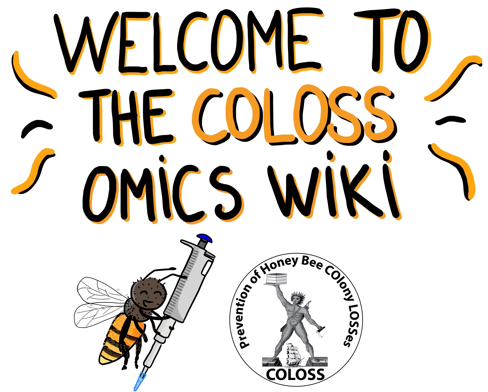

# **wikiCOLOSS BEEBOOK IV**
## Standard Methods and Good Practices for Apis Omics Research

This online resource is part of the chapter **“Standard Methods and Good Practices in Apis Honey Bee ‘Omics Research”** from the BEEBOOK Volume IV. It serves as a complementary online resource designed to evolve with advancements in molecular techniques, ensuring it stays up to date with cutting-edge methodologies.

Developed collaboratively by **16 honey bee experts**, this resource combines expertise to provide researchers with standardized methods and best practices for *Apis* omics studies. Learn more about the contributors in the **[Meet the Team](https://maevatecher.github.io/standard-methods-apis-omics/theteam/)** section.

### **Navigation**
Easily explore this resource using the **Table of Contents** on the left-hand side to find specific sections and tutorials.

---

### **Citation**
If you use the methods and tutorials provided here, please cite as follows:

> **Techer et al.**, *Standard Methods and Good Practices in Apis Honey Bee Omics Research*, Journal of Apicultural Research (TJAR), **(in press)**.

---

Thank you for contributing to and using this dynamic resource to advance honey bee omics research!
