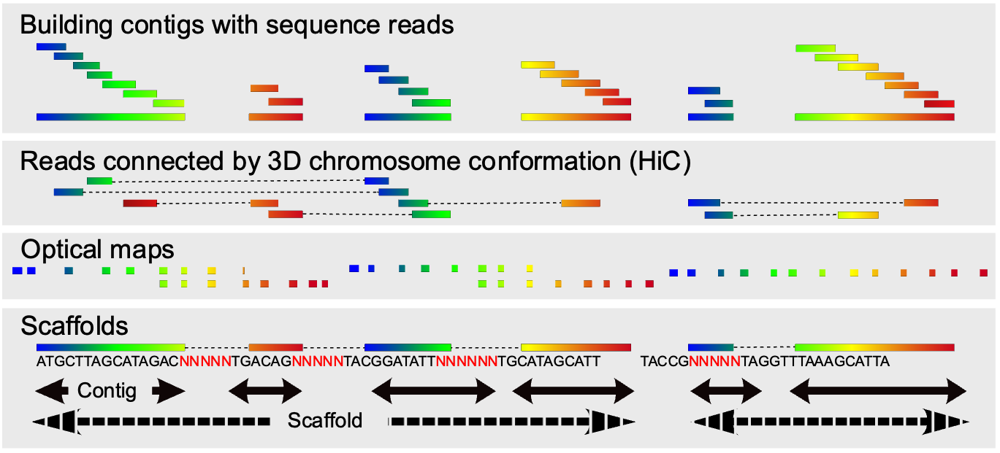

# 3. Genome sequencing

## 3.3. The reference genome

Genomic analyses, such as genome-wide association studies (GWAS), population genomics, and transcriptomics are virtually impossible to perform in the absence of a reference genome for the species studied. For instance, SNPs are detected by aligning sequence reads from samples to the reference and looking for the differences, transcriptome analyses align sequence reads from RNA samples to the reference genome, and transcript levels are determined by counting reads mapped onto the different annotated genes. Moreover, the accuracy of such analyses depends highly on the quality of the reference genome. A typical example in honey bees is the gene number estimation that went from a first Official Gene Set (OGSv1.0) of 10,157 protein-coding genes in version 2 of the assembly (Consortium & Others, 2006) to a much larger 15,314 protein-coding OGSv3.2 gene set detected in Amel_4.5 (Elsik et al., 2014). Among many reasons for this difference are the progress in DNA sequencing techniques and assembly algorithms. However, Amel_4.5 remained a very fragmented assembly. More recently, the utilization of long-read sequencing technologies has led to the development of an updated and highly contiguous genome assembly (HAv3.1) which has corrected many errors in chromosome segment ordering (Wallberg et al., 2019). Such a gapless assembly is also essential for accurate gene annotation (Denton et al., 2014). Using a single reference genome for all subsequent analyses will allow having a consistent coordinate system, which is indispensable for comparing results.

### 3.3.1. Assembling the reference genome

The reference genome should be as perfect as possible, and maximum effort must be made to use state-of-the-art technologies and bioinformatics strategies. As of the time of writing, the current honey bee genome build, HAv3.1, was produced using *PacBio* long-read sequencing, and the reads were assembled into contigs with **FALCON** (version 0.5.0). The contigs were then merged using additional information, mainly genetic maps, BioNano optical maps, and Hi-C chromatin interaction data (Figure 4A) (Wallberg et al., 2019).

###### Figure 4. Genome assembly. A) Contigs are first built by sequence overlap and connected together into scaffolds with linked reads, usually using HiC and/or optical maps. B) De novo assembly decisions can be influenced by polymorphism present in the sample used as reference. When reconstructing a haploid consensus sequence from a diploid individual, a certain proportion of mismatches must be allowed, to take polymorphisms into account. However, the presence of paralogous sequences in the genome will complicate the decision process. Sequencing a haploid drone solves this problem.

#### 3.3.1.1. Hi-C chromosome conformation capture

The Hi-C chromosome conformation capture method was developed for analyzing the 3D organization of the genome, including possible interactions between distant loci, either on the same chromosome or different chromosomes (van Berkum et al., 2010). However, most interactions involve relatively close loci, following the compaction of the DNA in the chromatin and topologically associated domains (TADs). Therefore, Hi-C is also used to detect read pairs that will map at distances in the order of 10 to 100 kb to help assemble contigs together in whole genome *de novo* sequencing. Hi-C method is particularly valuable in assembling regions of the genome that are challenging using conventional sequencing methods alone (e.g., due to inversions, large chromosomes, gaps and repetitive elements). To reveal the chromatin looping, Hi-C was utilized to compare the 3D genome structures of queen and worker larvae (Yong Zhang, He, et al., 2023). Hi-C and PacBio technologies are also used to generate the chromosome-scale assembly of the *Apis cerana* and *A. mellifera* genomes (Cao et al., 2021; Wallberg et al., 2019; Wang et al., 2020).

#### 3.3.1.2. DNA source selection

For technical reasons at first, and now for continuity reasons, all reference genome assemblies for the honey bee were done using inbred queens or drones from the DH4 strain; Bee Weaver Apiaries, Inc. (Consortium & Others, 2006; Elsik et al., 2014; Wallberg et al., 2019). Indeed, to mitigate assembly problems related to repeated DNA and gene families, polymorphisms in the individual selected for sequencing must be as low as possible. In diploid species, this is addressed by selecting a highly inbred sample. Honey bees, however, have a haplodiploid sex-determination system, so the problem with intra-individual polymorphism is eliminated by sequencing a single haploid male (drone) (Figure 4B).

### 3.3.2. Annotating the reference genome

Much of the information used to annotate genes within reference genomes is derived from RNA-Seq gene expression studies, most of which are conducted using short-read sequencing. The annotation for new RefSeq genomes can be requested out at no cost for the user through the NCBI team, using the Eukaryotic annotation pipeline Gnomon (Thibaud-Nissen et al., 2013). However, short reads do not capture all the information, especially in large, complex genomes which may have highly repetitive sequences. Some genes may be falsely merged or split, exons can be missing, and overall, the information on alternative splicing is missing. Ideally, annotation-driven work should now be revised and performed with long reads such as Iso-seq (*PacBio*). Many tools computational tools exist for user to perform or curate their own annotation (Ejigu & Jung, 2020). New annotation pipelines user-friendly like **BRAKER3** (Gabriel et al., 2024) are now using long read RNA-Seq and protein data to improve gene prediction.

### 3.3.3. High molecular weight DNA extraction

HAv3.1, being based on the DH4 honey bee strain, cannot represent the full diversity existing in all honey bee subspecies. Therefore, *de novo* assemblies for other representative individuals may need to be produced. Regardless of the DNA sequencing and mapping techniques used, a critical step is to ensure the genomic DNA extracted is of high molecular weight (HMW), typically 10 kb or higher. This is particularly important for long-read sequencing since reads will be long only if the DNA molecular weight is sufficiently high. Achieving this requires careful sample handling and DNA extraction, which can be challenging at first. Most problems reside at the sampling stage and first stages of DNA extraction.

To prevent quality issues related to contaminants such as cuticle and optical pigments, samples should be collected from larvae or white-eyed pupal stage. Co-purification of pigments with HMW DNA can lead to errors in spectrophotometric measurements and interfere with downstream DNA binding, as observed in other organisms (Adema, 2021; Fauchery et al., 2023). To preserve tissue integrity, these should either be fresh or flash-frozen in liquid nitrogen. To preserve high molecular weight DNA, the frozen sample can either be pulverized and the powder used for standard DNA extraction. Alternatively, a freshly sampled or thawed tissue can be gently ground in DNA extraction buffer. While there are many options for mechanical disruption, using a pestle is ideal to avoid fragmenting the DNA. DNA extraction can then be performed using standard procedures, for instance, the *QIAGEN* Genomic-tips 100/G (Cat No/ID: 10243). The actual sequencing and genome assembly is a very specialized work, using ever-changing sequencing technology and bioinformatics pipelines (Childers et al., 2021; LaFlamme, 2021; Lawniczak et al., 2022; Rice & Green, 2019).
