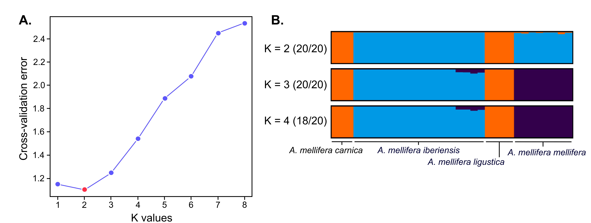

# 4. Whole-genome population and association studies

## 4.8. Population genomics: Inferring population structure using **ADMIXTURE**

To study the genetic differences among individuals, a population structure analysis can be performed. Many analytical tools have different assumptions. The principal component analysis (PCA) makes the least number of assumptions and is suited for a preliminary data view. There are also clustering methods that estimate the proportion of ancestral populations in each individual. The software **STRUCTURE** (Pritchard et al., 2000) is the classical tool for structure analysis, however, it is not suited to large datasets. Examples of clustering methods that can handle large datasets are **fastStructure** (Raj et al., 2014), **FRAPPE** (H. Tang et al., 2005), and the widely used **ADMIXTURE** (Alexander et al., 2009). The results obtained with population structure analysis are necessary before performing more sophisticated analyses. However, the results should not be over-interpreted because different demographic scenarios may produce similar results. Here, we will show a protocol for running **ADMIXTURE**.

**ADMIXTURE** (version 1.3) uses a maximum likelihood approach to estimate individuals’ ancestry from multilocus SNP data. It requires unrelated individuals and does not explicitly consider LD, so we advise avoiding strong LD in the dataset.

### 4.8.1. Download and installation

Download and install **PLINK** (see [Section 4.7](https://youneedawiki.com/app/page/1IUnW7oMAEYX0T5pebD3S0LaYgRaxJtc7d96HUFuaPa0?p=1rc183pyLOH9HstkT14kQP-SXKx-dffa2)), the online tool [**CLUMPAK**](http://clumpak.tau.ac.il/) (Clustering Markov Packager Across K (Kopelman et al., 2015), and [**ADMIXTURE**](https://dalexander.github.io/admixture/download.html) (version 1.3).

### 4.8.2. Input files

**ADMIXTURE** accepts **PLINK** and **EIGENSTRAT** files as inputs. Here, the *binary 1 PLINK* format will be used. Because of the **ADMIXTURE** assumptions, the file named pop *gen_MD_maf005_pruneddata* generated in [Section 4.7](https://youneedawiki.com/app/page/1IUnW7oMAEYX0T5pebD3S0LaYgRaxJtc7d96HUFuaPa0?p=1rc183pyLOH9HstkT14kQP-SXKx-dffa2)[.2.7]{.underline} will be used. **Note:** In case the relatedness of the individuals under study is unknown, plink2 and the following command line can be run:

``` bash
plink2 --bfile out_dataset \
--king-cutoff 0.177 \
--make-bed \
--out relpruned_data
```

### 4.8.3. Methods

**ADMIXTURE** estimates individuals’ ancestry considering a specific number of source populations commonly denoted by K. **ADMIXTURE** can be run for a predefined K when the number of source populations is known. Here, K can be set at two because the individuals used in the tutorial are of M- and C- lineage ancestry). To run **ADMIXTURE** for K = 2, the following command can be run:

``` bash
./admixture pop_gen_MD_maf005_pruneddata.bed 2 
```

Two files will be produced: the *pop_gen_MD_maf005_pruneddata.2.Q,* which contains the proportions of each cluster for each individual, and the *pop_gen_MD_maf005_pruneddata.2.P*, which contains the allele frequency of the source population for each SNP. However, commonly, the best K is unknown and should therefore be calculated. To do that, we should run **ADMIXTURE** for different Ks and use the flag --cv to enable the calculation of cross-validation errors. A way of doing that is through a bash command-line code, which we can call, for instance, *CV.sh.*

**Step 1.** Create and open the file *CV.sh:*

``` bash
nano CV.sh 
# or you can use any text editor such Vim
vi CV.sh
```

**Step 2.** Write a script to run **ADMIXTURE** for different Ks (here from 1 to 8) and with the flag --cv:

``` bash
#!/bin/bash -l
for K in {1..8} ; do 
./admixture --cv pop_gen_MD_maf005_pruneddata.bed ${K} 
done 
```

**Step 3.** Run the script created in step 2.

``` bash
chmod +x CV.sh
./CV.sh >admixture.out
```

**Step 4.** In the file *admixture.out* we have everything that was printed on the console, but we want to have just the CV values. For that, we can use the following command:

``` bash
grep "CV" admixture.out | awk '{print $3,$4}' | cut -c 4,7-20 > admixture.cv.error
```

We can now use the cross-validation error values in the file *admixture.cv.error* to construct a plot (Figure 11A). The smaller the cross-validation error value, the better the prediction. In the tutorial example, K = 2 is the best, suggesting the existence of two source populations. However, choosing the best K can be a difficult endeavor, and another approach is to run different Ks and use the one that makes the most biological sense.

In addition, to run different Ks we should also keep in mind that **ADMIXTURE** can produce different outcomes for replicate runs. A good practice is to perform several runs for each K with different random seeds (or starting points), which can be done using the flag -s time.

In the tutorial example, **ADMIXTURE** will be executed 20 times for each K. To save all the runs, we must change the name of the outputs, a task that is performed by the command mv. This command will change the names by appending the K and the run number. For example, consider *pop_gen_MD_maf005_pruneddata.4.10.Q* is the 10^th^ result for K = 4.

The script below should be written in a file called, for instance, *running_admixture.sh*. To run this, the same steps described for *CV.sh* should be performed.

``` bash
#!/bin/bash -l
for RUN in {1..20} ; do
for K in {1..8} ; do
./admixture -s time pop_gen_MD_maf005_pruneddata.bed ${K}
mv pop_gen_MD_maf005_pruneddata.${K}.P pop_gen_MD_maf005_pruneddata.${K}.${RUN}.P
mv pop_gen_MD_maf005_pruneddata.${K}.Q pop_gen_MD_maf005_pruneddata.${K}.${RUN}.Q
done
done
```

The last step is generating a plot showing the ancestry of each individual. An easy way of doing that is by using the online tool called **CLUMPAK** (Kopelman et al., 2015). **CLUMPAK** uses **Distruct** (Rosenberg, 2004) to generate the plot and **CLUMPP** (Jakobsson & Rosenberg, 2007) to align the multiple **ADMIXTURE** runs. When different solutions are found for the same K, **CLUMPP** will group the most similar solutions into “modes”. To run **CLUMPAK**, one just needs to use the Q-matrices of the runs. A folder containing all the Q files produced by **ADMIXTURE** can be created. In this example, such a folder can be called *Q_values* and then zipped. Next, on the “Main Pipeline” page, one just needs to choose the option **ADMIXTURE** and upload the zip folder.

The graphic output is shown on the main page for each K's major modes (Figure 11B). Each individual is represented by a thin vertical line, and each color represents an inferred ancestral population. The ancestry proportion corresponds to the length of the color in the vertical bar. Only one mode was found for K = 1, 2 and 3. However, for K = 4, the major mode is represented by 18 out of 20 runs, meaning that these 18 have similar solutions. Cross-validation testing determined that K = 2 was the most likely outcome.



###### Figure 11. Example of population structure graphical output using ADMIXTURE in four European honey bee subspecies. A. Plot of cross-validation error obtained by ADMIXTURE from K = 1 to K = 6. The lowest error was found for K = 2 and is marked in red. B. Graphical representation of ADMIXTURE results obtained by CLUMPAK. Here, the populations of A. m. carnica and A. m. ligustica are represented in orange, and A. m. iberiensis and A. m. mellifera are in blue. Of note is that some A. m. mellifera individuals have a small percentage of orange color, suggesting a history of introgression.

