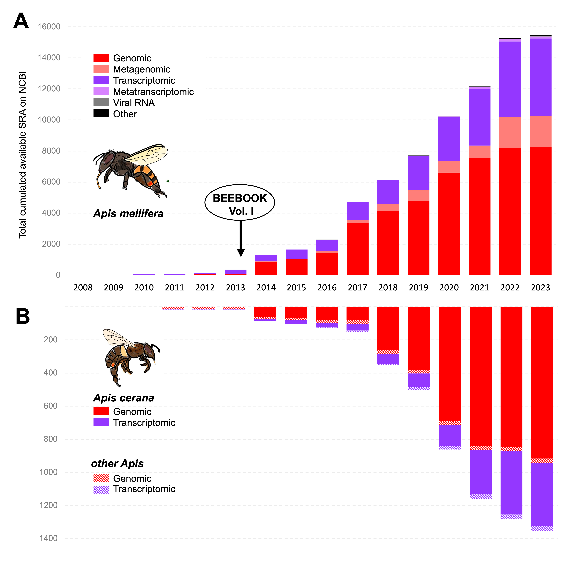
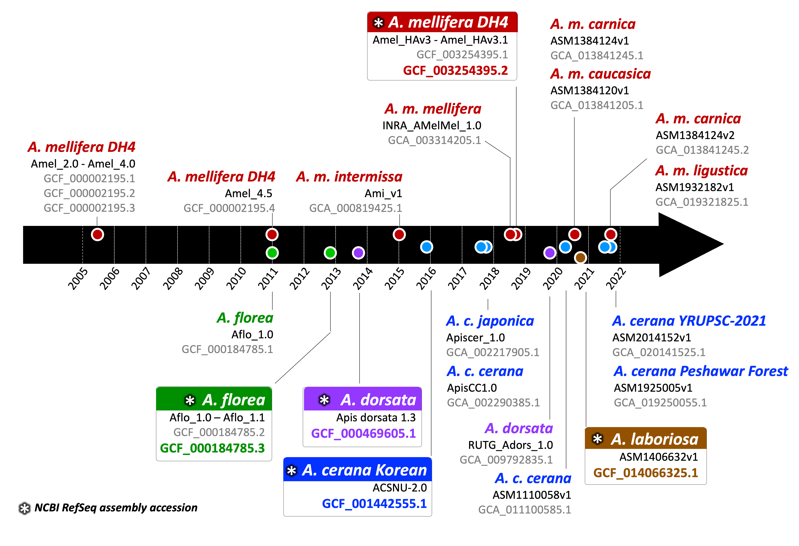

# 1. The ‘omics revolution in *Apis:* More data than meets the eye

While digging into our evolutionary history through archeology, we found that humans have interacted with bees for at least 40,000 years, revealing a profound and intricate connection (d’Errico et al., 2012). In the native range of the honey bee *Apis mellifera*, beeswax was utilized in pottery during the Neolithic agricultural revolution (Roffet-Salque et al., 2015). Given this ancient relationship and associated benefits, it came as no surprise that the western honey bee genome was among the first insects to be sequenced in 2006 (Honeybee Genome Sequencing Consortium, 2006; Toth & Zayed, 2021). This breakthrough paved the way for multiple research avenues and applications for studying *A. mellifera* evolution, biology, behavior, genetics, conservation, and health, which have been extensively reviewed by Toth and Zayed (2021) and Grozinger and Zayed (2020). Still, the *Apis* genus (*Apidae*, *Hymenoptera*) encompasses at least ten other species showing an incredible diversity of adaptations in Asia and Oceania (Panziera et al., 2022; Radloff et al., 2010; Randall Hepburn & Radloff, 2011).

Toth and Zayed (2020) have thoroughly summarized the explosive growth of honey bee genetics and genomics studies since 2006. Early on, short DNA and RNA sequences obtained via Sanger sequencing (~100-1500 bp) regularly enriched the *A. mellifera* GenBank database. Now, progressively high-throughput and next-generation sequencing (NGS) technologies produce millions of sequences per individual and must be compiled into “digestible” Sequence Read Archive (SRA) format. This massive volume of genetic data can be overwhelming and is likely underutilized. For example, our search in the SRA Run Selector of NCBI (accessed on 23 January 2023), yielded 15,458 hits strictly associated with `(Apis[Organism]) AND "Apis mellifera"[orgn:_txid7460]` (Figure 1A). This creates opportunities for processing and comparing large data sets of *A. mellifera* but requires a standardized baseline for future comparative questions and analyses.

The actual SRA size generated from *A. mellifera* genomes and metagenomes is surely underestimated here, due to inconsistencies in the metadata reports. Evans *et al.* (2013) anticipated the comparison hardships and discordances that could arise from such a global burst of data and responded with the first set of standard methods and molecular toolkits for *A. mellifera*. The timely publication of the resulting BEEBOOK chapter preceded the release of 99.2% (*n* = 8,185) and 94.1% (n= 4,715) of the total genomic and transcriptomic SRA available at the time of our survey, respectively. This emphasizes the need of standardizing not only the upstream data generation processes (*e.g.*, sampling, wet lab processing and sequencing) but also downstream processes (such as sharing and facilitating open access distribution online).

###### Figure 1. The cumulated short read archive on NCBI for A) “*Apis mellifera*” or B) “*Apis*” *stricto sensu* reflects the burst in genetic and genomic resources since the release of the western honey bee genome in 2006.

If *A. mellifera* remains the winning and most curated species within *Apis* genus, its sister species *A. cerana* displays an early similar growth trajectory (Figure 1B). Since 2011, multiple and improved versions of five *Apis* species genomes have been sequenced (Figure 2), offering new opportunities for the comparison of their biology and genomes. The development of new BEEBOOK chapters dedicated to *A. cerana* and the further recognition of its unique evolutive history and biological traits are likely to drive a burst in data generation, analysis, and sharing. Fortunately, many of the molecular standard methods are applicable beyond *A. mellifera* and, in some cases, transferrable to other arthropods (Childers et al., 2021; Lawniczak et al., 2022).

###### Figure 2. Five reference genomes of *Apis* honey bee species have been assembled and improved since the first genome release. The current timeline of the assemblies publicly released (*e.g.*, ACSNU-2.0 [GFC_001442555.1]), as well as the representative genome (RefSeq) for each species and subspecies, was built using the latest NCBI update.

In parallel, the emergence of new omics techniques and steady progress in wet lab and bioinformatics techniques urged a revision and expansion of the Evans *et al.* (2013) chapter. The data generated by epigenomics, proteomics, and metabolomics are also expanding resources, and it becomes crucial to understand how to analyze, use and share them efficiently. Ultimately, *Apis* research will move toward multi-omics integration, and it will become crucial to efficiently utilize unique or rare samples for multiple layers of data generation and analysis. We encourage niche-specialized *Apis* researchers to familiarize themselves with the outputs and capabilities of each omic method to fully leverage the wealth of accessible data. Leveraging our experience with the transient nature of omics technologies and bioinformatics pipelines, we have enhanced this BEEBOOK chapter into an interactive wiki-style format (Deligkaris, 2022). We compiled the most up-to-date methods while also describing the applications and limitations. Finally, we offer recommendations for the standardization of data sharing in view of the omics future in *Apis*. Our hope is that this chapter will become a lasting resource as the technologies continue to advance.
