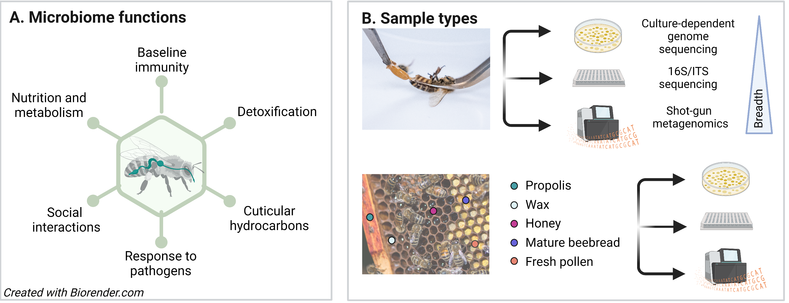

# 10. Microbiome analysis

## 10.1. Introduction

The increased concern for honey bee health has led to a collective effort by researchers to unravel the major contributors to honey bee fitness. Increasingly, the microbiome – the suite of microorganisms, from their genes to metabolites – is thought to play a major role in honey bee health. Nine main bacterial taxa compose the gut microbiome of honey bee workers, and among them, *Snodgrassella, Gilliamella, Bombilactobacillus*, *Lactobacillus* nr. *melliventris*, and *Bifidobacterium* form what is known as the core gut microbiome (Zheng et al., 2018). Thus far, we know these gut-associated bacteria contribute to the honey bee’s nutrition (Engel & Moran, 2013; Kešnerová et al., 2017), immune system (Kwong et al., 2017), detoxification of xenobiotics (Wu et al., 2020), response against pathogens (Raymann et al., 2018), colony structure through nestmate recognition (Vernier et al., 2020), and several other roles that ultimately impact colony fitness (Figure 22A).

Though the interconnectedness between honey bee gut microbiota and honey bee health is undeniable, the interconnectedness between honey bee health and the microbiome of hive interiors should also be taken into account. Honey bees are highly eusocial insects, meaning the entire colony - individuals, environments, and associated microbes - will impact the colony's success. Also, honey bees will spend most of their lives within the hive, where horizontal transmission of microbes between beehive environments and the individuals occurs (Anderson et al., 2013). Pesticides, for example, not only cause microbiota dysbiosis on honey bee guts (Kowallik & Mikheyev, 2021; Motta & Moran, 2020), but also accumulate to dangerous levels within hives (Calatayud-Vernich et al., 2018), and may thus affect the different microbial communities present within managed colonies. In addition, food reserves (bee bread, nectar, *etc*.) can also act as pathogen reservoirs within honey bee colonies and may contribute to pathogen transmission.

Until recently, the majority of bee microbiome investigations focused on the worker bee gut composition and used culture-dependent genome sequencing or 16S rRNA gene amplicon sequencing to characterize the entire bacterial community (Kwong et al., 2017). However, shot-gun metagenomic approaches have been proving that the microbiome of honey bees may be much more diverse than previously thought. In a single colony, the microbiome can greatly differ among individuals at the strain-level, and this translates to differences in functional capabilities (Ellegaard & Engel, 2019), which may be also related to the diversity of phages infecting these strains (Bonilla-Rosso et al., 2020; Deboutte et al., 2020). In addition, fungi are also starting to gain more notoriety in microbiome studies, since they are prevalent in bee colonies and may have important interactions with the whole microbial community and the bees (Anderson et al., 2011). Therefore, both amplicon sequencing (16S rRNA for bacteria, ITS for fungi) and shot-gun metagenomics are useful approaches in a microbiome study.

With modified sampling protocols, microbiome studies can be conducted on both tissue samples and hive samples, such as propolis, wax, and honey (Figure 22B). Here we present protocols for conducting basic tissue and non-tissue microbiome studies focused on culture-independent approaches that are appropriate for the first screen of bacterial and fungal communities. While some of the methods described here are equivalent to those described in Engel et al. (2016) and derived from general recommendation for microbiome studies (Hammer et al., 2015), we have included additional sample preparation measures to reduce noise in the data, procedures for sampling hive materials, a worked example of data analysis procedures (including amplicon sequence variant (ASV)-based analysis), links to external resources, and updated commentary on where the field is headed.

###### Figure 22. Microbiome overview. A) Ways the gut microbiome can influence honey bees and colony fitness. B) Types of samples and sequencing approaches. Results of culture-dependent genome sequencing are limited to taxa amenable to laboratory cultures, while shot-gun metagenomics offers the widest taxa breadth. Note the difference between mature bee bread (shiny surface) and fresh pollen (chalky surface). Photos by Leslie Kennah.

