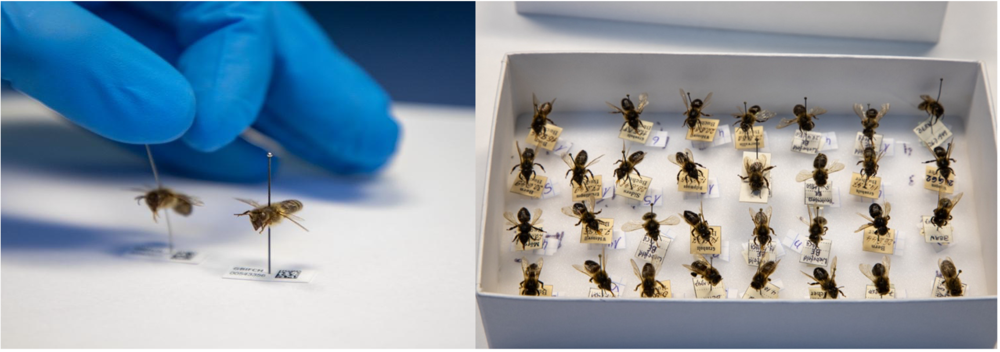
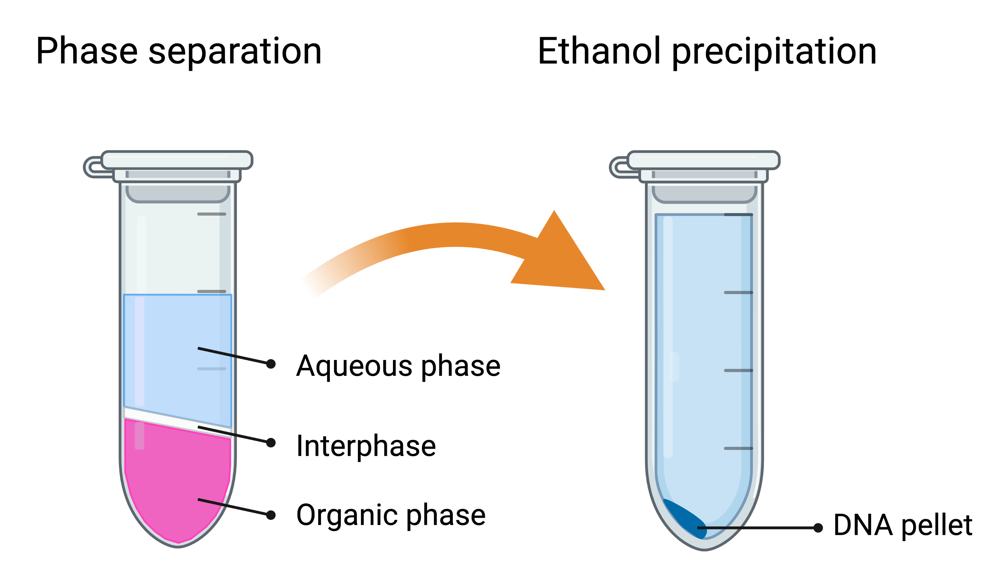

# 3. Genome sequencing

## 3.5. Sequencing museum specimens

Ancient and historic specimens offer an excellent and powerful opportunity to study macro- or micro-evolutionary changes (Short et al., 2018). Museum collections in particular, are ideal, as they can provide a temporal series of honey bee samples from different areas of their natural range. Analyzing old specimens enables us to gain insight into past genetic diversity, selection, domestication, speciation, migration, and phylogenomics (Card et al., 2021; Raxworthy & Smith, 2021). In fact, to study these processes directly, comparing historic and contemporary allele frequencies is the most direct and powerful method, in contrast to model-based approaches.

The main caveat of old samples is the challenge in obtaining high-quality DNA for molecular analyses, but improvements in DNA extraction protocols and sequencing technology are overcoming these difficulties (Orlando et al., 2021). Until recently, most of the studies using museum collections were based on PCR-amplification of target genes or mitochondrial DNA. However, due to DNA degradation, fragments may be shorter than the target region and cannot be amplified. In contrast, high-throughput sequencing enables us to sequence even very short DNA fragments. In the field of human genetics, protocols for high-throughput sequencing applied to historic and ancient DNA from archeological sites are relatively well established, but fewer efforts have been made in the application to historical museum collections from animals (Card et al., 2021; Grewe et al., 2021; Mikheyev et al., 2015, 2017) and plants (Kistler et al., 2020). For honey bees, sequencing of historic collections has already been successfully performed to study signatures of selection, changes in ancestry composition, and genetic diversity pre- and post-parasite arrival (Cridland et al., 2018; Mikheyev et al., 2015; Parejo et al., 2020) (Figure 5). The approaches employed are also applicable to other *Apis* species.

###### Figure 5. Left: Single dried, pinned honey bee worker museum specimens, Right: collection box with multiple museum specimens. To avoid cross-contamination with other samples, especially with present-day specimens, dedicated rooms, special personal protective equipment, and a cleaning workflow must be adopted. (Credit: M. Parejo)

### 3.5.1. Considerations
The following recommendations are not limited to ancient or museum-grade specimens. We suggest adhering to similar guidelines for handling *Apis* samples targeted for genomic material extraction to reduce contamination.

-   **Reducing contamination:** It is imperative to take the highest precautions and implement stringent measures to avoid any cross-contamination between samples, especially between contemporary and historical samples. We recommend strict separate handling of old and new samples, working under a hood or PCR workstation-type cleaned with UV light. The usage of filter tips for all steps should be seen as mandatory. Reliable DNA extraction from museum samples requires a clean and separated space where no previous bee material have been introduced. It is almost certain that such details will be demanded, and quality checked by reviewers of *Apis* museum genomics studies.

-   **Method choice:** The DNA extraction protocol described below is based on phenol-chloroform separation, as it typically yields the highest amount of DNA. This is crucial because only limited tissues may be available, such as legs. Whenever enough tissue is available and samples are less degraded, commercial DNA extraction kits (*e.g.* DNeasy Blood and Tissue kit from *QIAGEN* on honey bees from 1910-1999) also produce adequate DNA quantity and quality (Cridland et al., 2018).

-   **Hazardous agent:** Please note that phenol and chloroform are hazardous agents. It is of utmost importance that you work cleanly and safely. In addition to following basic laboratory safety precautions, perform all procedures in a chemical fume hood, wash hands thoroughly immediately after working with these chemicals, and use sealed safety tubes (*e.g.,* *Eppendorf* Safe-Lock tube) when centrifuging.

-   **Material choice:** The bulk tissue material used influences the success of DNA extraction and sequencing in chitinous organisms such as *Apis* honey bees. In some cases, there is no choice, as only non-destructive sampling is allowed by the curator for valuable museum specimens. While thorax sampling is typical for modern samples, thoraxes may contain a larger fraction of non-target DNA, such as contaminating fungi or bacteria (albeit far less than found in bee abdomens), and thus not represent the most suitable sample type. In contrast, hind legs have been shown to contain sufficient honey bee DNA with limited contamination (Parejo et al., 2020).

-   **Protocol optimization:** We recommend conducting initial protocol testing on less valuable samples, if available, and changing or adapting the protocols accordingly. *Apis* honey bee species vary in body size while the anatomical structure remains similar. Thus, it is easy to understand the yield difference of ancient DNA obtained from a leg of the giant honey bee *A. dorsata* compared to a leg of the small *A. florea* honey bee. Not only species, but also the conditions of collection and preservation will affect the quantity and quality of the DNA fragments. Remember that a large proportion of your samples will not yield enough DNA of sufficient quality for subsequent sequencing.

-   **DNA degradation:** It is not recommended to use a vortex to mix samples, as it can mechanically degrade DNA. Instead, a gentle and careful manual inversion of the tube several times to mix its content is advised.

### 3.5.2. Materials

1.  Large equipment: thermoblock and cooling benchtop centrifuge

2.  Dissection tools (cleaned with bleach and rinsed with ethanol)

3.  Pipettes

4.  Microtubes (1.5 ml and 2 ml, *Eppendorf*)

5.  Saline solution for initial cleaning

    -   Ringer solution (0.125M sodium chloride, 1.5mM calcium chloride dihydrate, 5mM potassium chloride, 0.8mM sodium phosphate dibasic, pH 7.4)

    -   Alternatively, PBS (137 mM NaCl, 2.7 mM KCl, 10 mM Na~2~HPO~4~, and 1.8 mM KH~2~PO~4~, pH 7.4) or Tris solution (150 mM NaCl, 50 mM Tris-HCl, pH 7.6) can be used

6.  Lysis buffer: ATL (*QIAGEN* or alternatively other commercial lysis buffers can be used)

7.  Proteinase K (20 mg/ml)

8.  Phenol-chloroform-isoamyl alcohol (25:24:1)

9.  Chloroform

10. Molecular grade glycogen (10 mg/ml)

11. Ethanol (72% and 100% solutions)

12. Sodium acetate (0.3 M final concentration, pH 5.2)

13. Ultra pure water (*Milli-Q*)

### 3.5.3. Procedure

#### 3.5.3.1. Preparation and lysis

1.  Clean 3-10% bench surface with bleach and rinse with 72% ethanol.

2.  Take the museum specimen, carefully cut the hind leg(s) and place them into a 1.5-2 ml *Eppendorf* tube filled with 1,000 μl Ringer solution.

3.  Gently invert for 20 min to clean and rehydrate.

4.  Take out the leg(s) and place on a new paper tissue to dry.

5.  Add 180 μl lysis buffer to a new 1.5 ml *Eppendorf* tube.

6.  Add leg(s).

7.  Add 20 μl of proteinase K, invert and quick spin.

8.  Incubate overnight at 56°C.

#### 3.5.3.2. DNA extraction

9.  After incubation, centrifuge and quick spin.

10. Transfer supernatant (\~190 μl) to a new tube (leaving the solid part of the tissue at the bottom).

11. Add 190 μl (equal amount) of phenol:chloroform:isoamyl alcohol to the supernatant.

12. Invert carefully for 5 min.

13. Centrifuge at 12,000 g for 5 min.

14. Pipette upper aqueous phase (\~100 μl) into a new tube, making sure not to touch the interphase (Figure 6).

15. Add 190 μl H~2~O (*Milli-Q*) to the remaining interphase and organic phase (back extraction).

16. Invert carefully for 5 min.

17. Centrifuge at 12,000 g for 5 min.

18. Pipette upper aqueous phase (\~200 μl) into the same tube containing previously pipetted aqueous phase, making sure not to touch the interphase.

19. Add 300 μl of chloroform to the tube with aqueous phase (equal volume) to remove remaining phenol.

20. Invert carefully for 5 min.

21. Centrifuge at 12,000 g for 5 min.

22. Pipette supernatant into a new tube, making sure not to touch the interphase.

###### Figure 6. Sample appearance during phase separation and precipitation steps during the extraction. Created with Biorender.com.

#### 3.5.3.3. Precipitation

23. Add 1 μl of 10 mg/ml glycogen solution to help make the pellet visible upon precipitation.

24. Invert for 2 min.

25. Add 20 μl sodium acetate (10% of the volume).

26. Add 2.5 – 3 volumes of ice-cold 100% ethanol (\~600 μl).

27. Place the tube at -80°C for 1.5 – 2 h.

#### 3.5.3.4. Washing

28. Centrifuge at 13,000 g at 4°C for 30 min.

29. Identify the pellet, and pipette away liquid.

30. Add 850 μl 72% ice-cold ethanol.

31. Invert carefully 1-3 times making sure not to detach the pellet.

32. Centrifuge at 13,000 g at 4 °C for 10 min.

33. Identify the pellet, and pipette away liquid.

34. Repeat the wash steps 30-33.

35. Quick spin.

36. Pipette away the last drops of ethanol and let it dry for 30 min at 37°C to let it dry.

#### 3.5.3.5. Final solubilization

37. Add 40 μl of H~2~O (*Milli-Q*).

38. Carefully mix by pipetting up and down several times (do not vortex).

39. Incubate at 4°C overnight for full solubilization.

**TIP:** A final, optional DNA purification step can be performed using magnetic beads (*e.g.* *QIAGEN*'s EZ1® DNA Tissue Kit). This step will remove co-extracted small molecules that could act as inhibitors in downstream enzymatic reactions. However, it will also yield less total extracted DNA.

### 3.5.4. Sequencing of museum and ancient genomes

Depending on the age and storage conditions of your samples, the DNA will be more or less degraded and different subsequent sequencing strategies might be used. If sufficiently high-quality DNA is extracted, standard whole-genome sequencing libraries can be prepared (see [Section 4](https://maevatecher.github.io/standard-methods-apis-omics/Section_4_1/)). In fact, most of the historic and ancient DNA sequence data have been produced using *Illumina* technology due to the high data output, cost-effectiveness, and relatively low error rates. It works well on short sequences and is thus particularly well suited to sequence DNA in the range of 50–150 bp, which characterizes most degraded old DNA. Specific protocols for library preparation of ultra-low quantity DNA exist from a variety of companies (*e.g.,* Nextera DNA Library Preparation Kit (*Illumina*); NEBNext Ultra II kit (*New England Biolabs*, *Inc*). For degraded DNA it is not recommended to perform any size selection during the library preparation. We recommend to check with your local sequencing facility for recommendations. Before sequencing, we suggest to evaluate degradation levels and identify possible pollutants, such as formaldehyde, in the prepared libraries with a fragment analyzer (*e.g.* Bioanalyzer or 4200 TapeStation System (*Agilent Technologies Inc.)*).

As an alternative to whole-genome shot-gun sequencing, it is also possible to utilize hybridization capture methods. In particular, for samples with low endogenous DNA content, shot-gun sequencing is inefficient and expensive. For such samples, hybridization enrichment provides an approach to enrich a DNA sample for specific (and larger) genomic regions (for example, targeted genes, the exome or mitogenome). These approaches not only reduce analytical costs but also maximize the chances of identifying DNA present even in limited abundance. A typical limitation of hybridization-based genome reduction techniques is that custom probe design and synthesis are rather laborious and costly. Recently, a new and cost-effective method, hybridization restriction-associated-DNA (HyRAD) has been developed that uses double enzymatic restriction of fresh DNA extracts to build RNA probes that cover only a fraction of the genome and can serve as baits for capturing homologous fragments from old DNA libraries (Suchan et al., 2021). This can be a suitable, cost-effective approach for non-model organisms, such as *Apis* species.

For *A. mellifera*, which has well-established genomic resources, an alternative approach is to use SNP panels. These panels target specific SNPs, that can provide information on population structure, diversity and ancestry, or can be used to investigate functional genes or alleles that may be associated with particular phenotypes. Custom genotyping panels can be created, but a number of pre-designed SNP arrays are available as ready-to-use assays for the western honey bee (Chapman et al., 2017, 2015; Henriques et al., 2021; Momeni et al., 2021; Muñoz et al., 2015). A caveat to keep in mind for both targeted enrichment and SNP panel approaches is the ascertainment bias that can be introduced by the selection of particular probe sets, which can affect downstream estimates of population genetic statistics.

Finally, novel sequencing techniques are constantly being developed. We recommend following the latest research of human ancient genomics for an overview on the latest developments (Orlando et al., 2021).

### 3.5.5. Guidance on the data analysis methods

Sequence data clean-up and strict filtering is crucial for reliable variant calling and subsequent analyses and interpretation of the data. Ancient DNA has “mistakes” at the ends caused by deamination of cytosine, which are converted into uracil and thereafter sequenced as thymine analogues. This process is responsible for the sequencing artifacts observed as misincorporations of G→A at the 5′ and C→T at the 3′ ends. The frequency of this DNA damage increases with the age of a sample and can be statistically evaluated and taken into account during bioinformatic analysis. To evaluate DNA damage, it is recommended to perform a quality check of raw sequence reads using (*e.g.* [**DamageProfiler**](https://github.com/Integrative-Transcriptomics/DamageProfiler) or [**mapDamage2**](https://ginolhac.github.io/mapDamage/). The latter program also enables users to rescale quality scores of likely damaged positions in the reads. In this way, “damaged” positions will have less weight for mapping and subsequent variant calling. A critical step is to use strict read trimming to remove adapters and low-quality terminal sequences (as identified for instance by **DamageProfiler**). Also overlapping read pairs, resulting from shorter DNA fragments than sequencing read length, may be collapsed into consensus sequences (*e.g.* by using [**BBmerge**](https://github.com/BioInfoTools/BBMap/blob/master/sh/bbmerge.sh)).

Once the raw sequence data has been sufficiently cleaned, standard variant calling pipelines and analyses can be followed (see [Section 3.4](https://maevatecher.github.io/standard-methods-apis-omics/Part_3_4/) and [Section 4.3](https://maevatecher.github.io/standard-methods-apis-omics/Part_4_3/)). Some tips include adjusting parameters for mapping specificity and sensitivity. Moreover, rather than actual variant calling, it is possible to use genotype likelihoods instead, and in this way account for the uncertainties and lower base qualities of ancient DNA bases. This can be done within the framework of The Genome Analysis Toolkit ([**GATK**](https://gatk.broadinstitute.org/hc/en-us)) or Analysis of Next Generation Sequencing Data ([**ANGSD**](http://www.popgen.dk/angsd/index.php/ANGSD)) that covers a wide range of analytical population genetics statistics.

### 3.5.6. Applications and limitations

Any ancient historic DNA study is only as good as the sampling and careful interpretation of results. For instance, low genetic diversity in historic samples could result from the fact that all honey bees were from the same colony. Often in ancient and museum specimens, limited knowledge of sampling conditions is available, and it may not be known whether the samples were collected from managed hives or in the wild. Cautious interpretation is thus crucial. Nevertheless, ancient honey bee genomics of museum samples has a great potential to illuminate the evolutionary history of species and different subspecies, to identify the timing of population splits, and investigate signatures of natural selection (Cridland et al., 2018; Mikheyev et al., 2015; Parejo et al., 2020). Moreover, the approaches can not only be applied to study the past diversity of bees but also their historically associated pathogens and microbiomes. Thus, new lines of investigation could be the study of the evolution and spread of pathogens and the genetic responses of hosts, as well as past bee health related to its microbiome.
