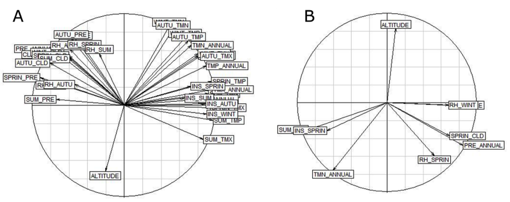

# 4. Whole-genome population and association studies

## 4.9. Landscape genomics: An example using **LFMM**

Landscape genomics, which addresses how local environmental conditions influence the distribution of genetic variation (Manel et al., 2003), is an increasingly important field. To identify associations between environmental variables and genomic variation, various approaches known as genotype-environment association (GEA) or environmental association analysis (EAA) have been developed. Examples of GEA-based software are **Bayenv2** (Günther & Coop, 2013), **LFMM** (Frichot et al., 2013), and **Samβada** (Stucki et al., 2017).

When compared to F~ST~-based methods, GEA methods can potentially identify selective pressures driving local adaptation. Besides, the combined analysis of genetic data and environmental data increases the power to detect loci that may be under selection (De Mita et al., 2013; de Villemereuil et al., 2014; Rellstab et al., 2015). However, each GEA method has advantages and disadvantages (see (Rellstab et al., 2015)) for further details), and combining different approaches helps reduce uncertainty of the results. Here, we will describe how to use the latent factor mixed model approach (**LFMM**).

**LFMM** is available in a command line version (1.5), and it can be downloaded from <https://bcm-uga.github.io/lfmm/index.html.> The latest version (2.0) is also available in an **R** package called **lfmm**. This tool models the effect of population structure using latent factors; therefore, population structure should be previously investigated. Here, the results obtained in the [Section 4.8](https://maevatecher.github.io/standard-methods-apis-omics/Part_4_8/) will be integrated in this example.

### 4.9.1. Materials

To run **LFMM**, two datasets will be required:

-   Genomic dataset: The *PLINK 1 binary* file obtained in [Section 4.7](https://maevatecher.github.io/standard-methods-apis-omics/Part_4_7/), called *pop_gen_MD_maf005.*

-   Environmental variables dataset: A file called *ex_env.csv*, containing 36 variables for each individual.

To have the environmental variable dataset the geographical coordinates of each apiary are needed. These coordinates are then used to obtain environmental variables from publicly available databases such as WorldClim, Climatic Research Unit, and OPENEI. A function within the **R.SamBada** package, (Duruz et al., 2019) called *createEnv*, can help in this process (**R.SamBada** documentation can be found at [https://cran.r-project.org/web/packages/R.SamBada/R.SamBada.pdf).](https://cran.r-project.org/web/packages/R.SamBada/R.SamBada.pdf).)

### 4.9.2. Methods

To prevent problems caused by non-independency of environmental variables, first, it is important to determine if they are correlated with each other. To do that, the **R** packages **ade4** (Thioulouse et al., 2018) for PCA computation, and **factoextra** (Kassambara & Mundt, 2017) for PCA visualization, will be needed. The following steps are pursued in **R** code:

**Step 1.** Install and open the **R** libraries:

``` r
install.packages("ade4") #PCA computation
install.packages("factoextra") #PCA visualization
library(ade4)
library(factoextra)
```

**Step 2.** Read the file with environmental variables:

``` r
ex_env <- read.table("ex_env.csv", 
header = TRUE, #The file contains a header
row.names=1, #Row names are in the first column
sep = ";")
```

**Step 3.** Perform a PCA with the environmental variables:

``` r
ex_env.pca<- dudi.pca(ex_env ,
scannf = FALSE, #Hide screen plot
nf = 5) #Number of components kept in the results
```

**Step 4.** Make a correlation circle

``` r
s.corcircle(ex_env.pca$co)
```

A correlation circle similar to that of Figure 12A will be obtained. Here, the direction and the length of arrows indicate the correlation between the variables as well as between variables and principal components. For instance, in Figure 12A, the variables AUTU_TMP and TMN_ANNUAL have the same direction, the same length and are very close to each other, which indicates that they are highly correlated. Indeed, the correlation value (r^2^, calculated in the next step) is 0.99. On the other hand, the variables pointing to opposite sides of the graphs, for instance SUM_TMX and AUTO_CLD, are negatively correlated (r^2^ = -0.80).

**Step 5.** Calculate a correlation matrix using the following commands:

``` r
cor_matrix=cor(ex_env, method='pearson') #To calculate the correlation values
write.csv(cor_matrix, file = "cor_matrix.csv") #To save the matrix in a file
```

Following that, a file called *cor_matrix.csv* will be created. The values with \|r\| \> 0.80 should be deleted from the environmental dataset. After this, the same procedure described above (**Steps 1 - 4**) should be performed again to obtain a diagram similar to Figure 12B, to check that the represented variables (eight in total) are independent.



###### Figure 12. Correlation circles with A) 36 variables and B) 8 variables, after removing the highly correlated variables (\|r\| \> 0.80).

Now that the bioclimatic dataset is prepared, the genetic dataset needs to be handled. LFMM accepts its own format (.lfmm), and the software has a function to convert PED format to .lfmm.

**Step 6.** Convert the *pop_gen_MD_maf005* binary *PLINK 1 binary* file obtained in [Section 4.7](https://maevatecher.github.io/standard-methods-apis-omics/Part_4_7/) to a *regular PLINK text* file.

``` r
plink --bfile pop_gen_MD_maf005 --keep-allele-order --recode --out
```

**Step 7.** Convert the PED file to .lfmm using the **R** function of **LEA**, ped2lfmm. The tutorial dataset contains 33 individuals and 2,365,431 SNPs. In order to efficiently upload this data into R, the **data.table R** package will be used.

``` r
# To install LEA
if (!requireNamespace("BiocManager", quietly = TRUE))
install.packages("BiocManager")
BiocManager::install("LEA")
 
#To download the package data.table
install.packages("data.table") 
 
#Loading the package lea
library(LEA) 

#Loading the package data.table
library("data.table")
 
#Convert ped format to lfmm
output <- ped2lfmm("pop_gen_MD_maf005.lfmm") 
 
#Loading the ped file to R
geno <- fread("pop_gen_MD_maf005.ped", showProgress = FALSE) 
```

Note that, when the format PED is converted to the lfmm format, the names of the SNPs that were in the MAP file will be lost.

**Step 8.** Upload the eight independent environmental variables, but without the individuals’ names that are in the first column.

``` r
#Load the reduced environmental file
env <- fread("ex_env_red.csv")
 
#Select from column 2 to 9 
env=env[,2:9]  
```

**Step 9.** Perform the association analysis between the environmental variables and the genotypes. To that end, we need to run a function (lasso_lfmm) to estimate the latent factor mixed model parameters. The results of this function will be used by the function lfmm_test to calculate the significance of the associations.

``` r
#To download the package lfmm
install.packages("lfmm")
 
#To load the package lfmm
library("lfmm") 
 
lfmmlasso <- lfmm_lasso(Y = geno,#The genotypes matrix
X = env, #The environmental matrix
K = 2, #The best K calculated previously
nozero.prop = 0.01)
 
pv <- lfmm_test(Y = geno, X = env,
lfmm = lfmmlasso, #The results obtained previously
calibrate = "gif")
```

**Step 10.** The variable pv is a list and contains different types of information, such as the p values and the calibrated p values for all eight environmental variables. If one wants to see the calibrated p values of the first loci the following command should be typed:

``` r
head(pv$calibrated.pvalue)
```

**Step 11.** This command will retrieve the first six calibrated p values for each one of the eight environmental variables. Each environmental variable is in a specific column. For instance, altitude is in the first column and SUM_PRE in the third column. If we want to see only the p-values of SUM_PRE, we just need to specify that this variable is in the third column, using the following command:

``` r
head(pv$calibrated.pvalue[,3])
```

**Step 12.** Select one environmental variable to continue with the procedure. The data obtained for SUM_PRE (third column) will be used. Here, the calibrated p values will be saved in the variable pvalues_pre_ver.

``` r
pvalues_pre_ver <- pv$calibrated.pvalue[,3] #SUM_PRE is the third column
```

**Step 13.** Make a Manhattan plot coloring the SNPs with p value \< 0.0001, which corresponds to -log10(p value) \> 4, in red and the others in grey.

``` r
#The name of the image to be created
jpeg(filename=" Manhattan.jpeg")
 
#Plot the -log10 of the calibrated P-values 
plot(-log10(pvalues_pre_ver), pch = 19, #Each P-value is represented by a circle
cex = .2, #To specify the size of the circle
xlab = "SNP", ylab = "-Log P",#To label X and Y axis
col = ifelse((-log10(pvalues_pre_ver)) > 4,'red','grey')) #Values >4 in red and the others in grey
 
#To save the image in the working directory
dev.off() 
```

**Step 14.** Count the SNPs significantly associated with SUM_PRE (p value \< 0.0001) and save the positions of the SNPs significantly associated with SUM_PRE in a variable called pvalue_00001_pos. In the tutorial example, there are a total of 1,215 SNPs with p value \<0.0001.

``` r
length(pvalues_pre_ver[pvalues_pre_ver<0.0001])
pvalue_00001_pos=which(pvalues_pre_ver<0.0001) 
```

**Step 15.** Create a file in the directory with the information contained in pvalue_00001_pos.

``` r
write.table(pvalue_00001_pos,"pvalues_00001.csv",row.names = FALSE, col.names=FALSE)
```

**Step 16.** Get thegenomic coordinates from the file positions of the outlier SNPs. Use the *pop_gen_MD_maf005.map* coordinates and retrieve only the positions indicated in *pvalues_00001.csv*.

To that end, the following steps can be performed:

1\. Create a file called *index2snp.sh.*

``` bash
nano index2snp.sh
```

2\. Type the following code in the file and close it.

``` bash
#!/bin/sh
cat pvalues_00001.csv | while read line; do
sed -n ${line}p pop_gen_MD_maf005.map >> pvalues_00001_snp_name
done
```

3\. Allow executing of the file.

``` bash
chmod +x index2snp.sh
```

4\. Run the file.

``` bash
./index2snp.sh
```

**Step 17.** Annotate theoutlier SNPs. To that end, the tool **SnpEff** (Cingolani et al., 2012) can be used in the Galaxy server. **SnpEff** accepts as input a VCF file. Thus, the first step is to build a VCF only with the outlier SNPs, which can be done in **PLINK**. To reduce the size of the VCF file, only one individual will be included in the tutorial example. The following steps are required to annotate the outlier SNP:

1\. Create a file with the Family and Individual ID that will be retained. In the example by writing “car ID1” in the file *one_ind*.

``` bash
nano one_ind
car ID1
```

2\. Create a file with the SNPs list to be retained.

``` bash
awk '{print $2}' pvalues_00001_snp_name > outlier_snp
```

3\. Create a VCF file.

``` bash
plink --bfile pop_gen_MD_maf005 \
--keep one_ind `# list of individuals to keep ` \
--extract outlier_snp `# list of SNPs to keep` \
--recode vcf --out outlier_snps
```

4\. Go to [Galaxy](https://usegalaxy.org/) and select the tool “SnpEff download” and write “Apis_mellifera” in the box “Select the annotation database you want to download”.

5\. While on the Galaxy platform, go to the “SnpEff eff” tool and upload the *outlier_snps.vcf* file. In “Genome source,” select “Downloaded snpEff database in your history” and in “Genome data,” select the database downloaded in the previous step.

After this step, Galaxy will provide a report with statistics (in input HTML stats file) such as the number of missense variants and the number of SNPs per chromosome. A second file shows all the genes and regions in which SNPs are located. Similar to many other selection studies, most selective SNPs detected in the dataset tested herein fall outside of exons (609 intergenic and 573 intronic). There were only 25 exonic SNPs, two of which appear to be missense or non-synonymous, and these were located in candidate genes GB42150 and GB46140.

While genome-wide scans provide a powerful way of highlighting candidate genes for selection, causal inferences about the molecular basis of adaptation can be obtained from functional and expression studies and also from *in silico* protein modeling (Henriques, Wallberg, et al., 2018). Nonetheless, before employing such approaches, cross-validation of detected outlier SNPs should be always sought by other conceptually different methods.

