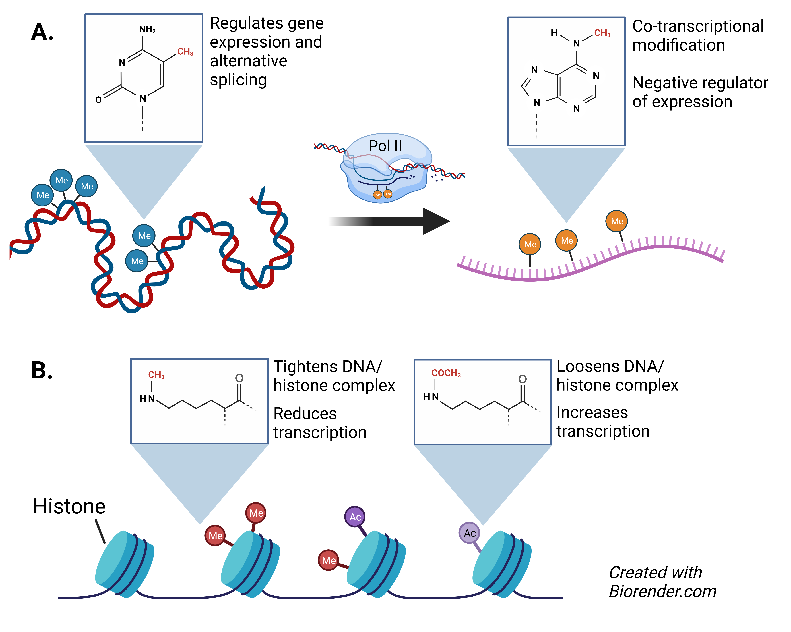

# 5. Epigenomics

## 5.1. Introduction

Genetic components of genes are the fundamental basis of molecular mechanisms for social evolution (Rehan & Toth, 2015). Gene expression and regulation are precisely programmed not only by the sequence of the DNA, but also by epigenetic modifications occurring on the genomic DNA (Tirado-Magallanes et al., 2017; Yong et al., 2016), on messenger RNA (mRNA) (Peer et al., 2017; Wang et al., 2021), proteins that interact with DNA (Shirvaliloo, 2022), chromatin accessibility (Liu et al., 2019) transcription factor binding motifs (Hu et al., 2010), and other non-coding RNA (Benayoun et al., 2015; Ruffo et al., 2023). These factors collectively contribute to the intricate programming of gene expression and control.

Honey bees are known to be among the arthropods embodying remarkably the phenomenon of phenotypic plasticity, particularly regarding development, reproductive abilities, and behavior (Corona et al., 2016; Pfennig et al., 2010). In a colony, there are not only different castes (such as queens and workers) but also different divisions within workers (such as nurses and foragers), all of which can arise from the same genome. Many of the differences between these phenotypes responding to change in environmental cues (*e.g.*, nutrition, pheromones, colony size and stress) are driven by epigenetic changes (Figure 14A & B) which are molecular modifications that regulate genes without changing the actual DNA sequence (Feinberg, 2007; Haig, 2004; Jirtle & Skinner, 2007). DNA methylation (Glastad et al., 2014; Herb et al., 2012; Kucharski et al., 2008; Oldroyd & Yagound, 2021; Shi et al., 2011), RNA methylation (Wang, Xiao, et al., 2021), histone modifications (Glastad et al., 2019), microRNAs (Ashby et al., 2016; Behura & Whitfield, 2010; Shi et al., 2012), other non-coding RNAs (Glastad et al., 2019; Tadano et al., 2009), or organization and material state of chromatin (Wojciechowski et al., 2018) are all examples of epigenetic mechanisms. However, DNA methylation and histone modifications are among the most commonly studied, and new attention is being given to RNA methylation. Therefore, this chapter focuses on these three types of epigenetic modifications.

Honey bees have a DNA methylation system with two key enzymes: DNA-methyltransferase 1 and 3 (DNMT1 and DNMT3) (Wang et al., 2006). The most common covalent modification of DNA is the methylation on the position 5 of the cytosine base (5-methylcytosine, or 5mC), which often appears with guanine (CpG) (Li-Byarlay, 2016; Maleszka, 2008; Ruden et al., 2015; Wang & Li-Byarlay, 2015; H. Yan et al., 2014). Compared to vertebrate species, the honey bee genome has lower coverage of CpG DNA methylation (Bewick et al., 2017; Schmitz et al., 2019).

Environmental factors, such as changes in nutrition, biotic stress and other external stimuli (e.g., resource availability), can affect honey bee caste determination, development, and behavior (Drewell et al., 2014; Foret et al., 2012; Galbraith et al., 2015; Herb et al., 2012; Kucharski et al., 2008; Li-Byarlay et al., 2020; Lyko et al., 2010; Remnant et al., 2016). These changes are often mediated by epigenetics. Epigenetics is, therefore, a bridge linking genetics and the environment, contributing to the complex biology of honey bees (Wang & Li-Byarlay, 2015). However, the parent-specific gene expression, as associated with the kinship theory of intragenomic conflict, did not involve DNA methylation (Wu et al., 2020).

###### Figure 14. Major epigenetic modifications. A) DNA methylation marks (methylated cytosine, or 5mC) and RNA methylation marks (N6-methyladenosine, or m6A). B) Histone methylation and acetylation.
