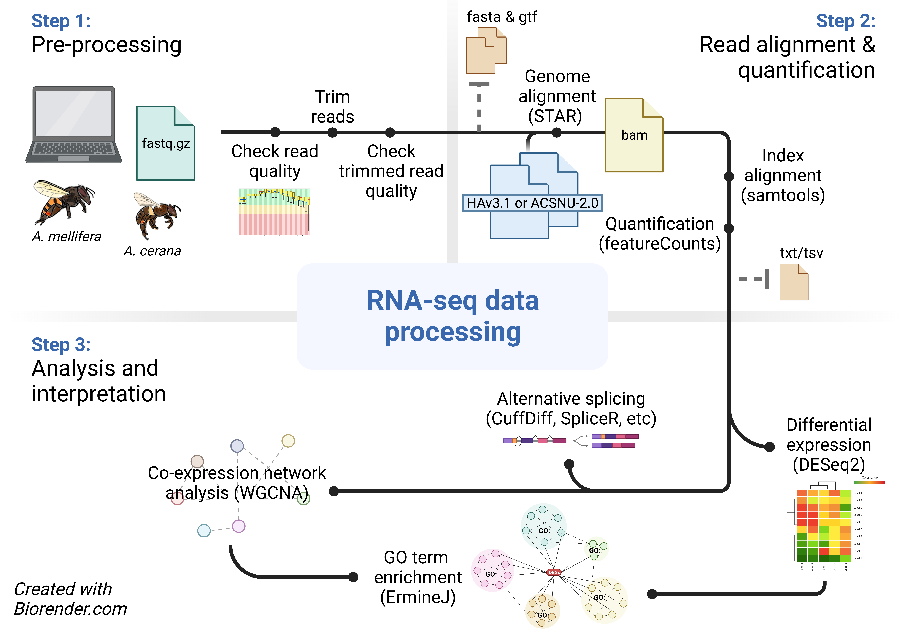

# 6. Transcriptomics

## 6.4. Data handling and analysis

### 6.4.1. RNA-seq and differentially expressed genes (DEGs)

To identify differentially expressed genes in RNA-seq data obtained from a minimum of two conditions/treatments, here we provide an example analysis pipeline (Figure 15) using the aligner software **STAR** (spliced transcripts alignment to a reference) (Dobin & Gingeras, 2015), the software package **Subreads** (Liao et al., 2013)and a reference genome. Many bioinformatic pipelines exist for such analysis, some of which use open-source workflows and containers such as Nextflow to create community curated frameworks that facilitate and standardize DEGs detection (Ewels et al., 2020; Wratten et al., 2021). For example, nf-core/rnaseq pipeline offers an alternative to our proposed method, allowing for alignment to the genome with **STAR** or pseudo-alignment to the transcriptome with **Salmon** (Patro et al., 2017) or **Kallisto** (Bray et al., 2016)and adaptable for both bulk-tissue and single-cell transcriptomes. Additionally, it is important to mention that pseudo-alignment workflow might be better suited to users with a limited computational power and time as it achieves similar accuracy in terms of transcripts quantification than reference-anchor mapping and reads counts (Bray et al., 2016).

The resulting processed data can then be analyzed for differential expression using the R package, **DESeq2** (Love et al., 2014). We optionally recommend that users compare and cross-validate the differential expression results with those of other packages, such as **edgeR** package (Liu et al., 2021), to verify the overlap of genes found up- and down-regulated. If the overlap is significant, this increase our confidence in identifying true differentially expressed genes, as both DESeq2 and edgeR varies in their statistical models to estimate differential expression. These software benefits from frequent updates and comprehensive tutorials are made available by the developer (e.g., [DESeq2](https://bioconductor.org/packages/devel/bioc/vignettes/DESeq2/inst/doc/DESeq2.html), and [edgeR manual](about:blank)).



###### Figure 15. Example RNA-seq data analysis pipeline using a genome as anchor. Many software options are available for each step; only selected standard softwares are shown. Note key paces where data export may be desirable. Created with Biorender.

**Step 1.** After data pre-processing and quality control, map reads to annotated *Apis mellifera* genome.

-   **STAR** can be run in the command line to map RNA-seq reads to a supplied reference genome. The most current version of the honey bee genome is Amel_HAv3.1 and can be downloaded on [NCBI RefSeq](https://www.ncbi.nlm.nih.gov/genome/48?genome_assembly_id=403979).

-   For running **STAR** in command line, generate a directory for the genome by using the following command:

``` bash
mkdir starAligned
```

**Step 2.** Create the genome index with the following command:

``` bash
STAR --runThreadN 4
--runMode genomeGenerate 
--genomeDir starAligned 
--genomeFastaFiles /path/to/FASTAfiles 
--sjdbGTFfile /path/to/GTF
```

The parameters were chosen for the following reasons:\
`--runMode genomeGenerate` indicates we are in the mode to build genome index in the directory `--genomeDir starAligned`.\
`--sjdbGTFfile /path/to/GTF` indicates that we want the annotation file in GTF format.

**Step 3.** Map the reads from the RNA-seq data onto the indexed genome, and place the counts into a table to be used later for the identification of differentially expressed genes. For paired reads, both the forward and reverse read will need to be provided as input. Because the FASTQ files are zipped, `readFilesCommand gunzip -c` must be used to unzip the files to be accessed by the mapping program. This script generates the aligned reads in a BAM file to be used by **featureCounts**.

**TIP:** Further questions related to the application of **STAR** can be found in the [**STAR** manual](https://github.com/alexdobin/STAR/blob/master/doc/STARmanual.pdf).

``` bash
STAR --runThreadN 4 
--readFilesIn /path/to/genomeDir 
--readFilesIn /path/to/fastq1r1.gz,/path/to/fastq2r1.gz,\
/path/to/fastq1r2.gz,/path/to/fastq2r2.gz   
--genomeDir starAligned 
#--quantMode TranscriptomeSAM GeneCounts
--outFileNamePrefix sampleName 
--outSAMtype BAM SortedByCoordinate 
--readFilesCommand gunzip -c 
```

`--runThreadN 4` indicates that we run the mapping process using 4 threads.\
`--genomeDir` indicates where the genome index is located.

`--outSAMtype BAM SortedByCoordinate` indicates that the output should be in BAM format and sorted by coordinates.

Alternatively to **featureCounts**, we can also use directly the `--quantMode TranscriptomeSAM GeneCounts` to produce two outputs, one with the Read Count for each gene and one with the gene aligned to the transcriptome only.

**Step 4.** Counting reads can be accomplished using the **featureCounts** program, part of the **Subreads** package, in the command line. Once you have loaded **Subreads**, running the following command quantifies the reads associated with each gene. When the program is supplied with multiple BAM files, it will combine those reads into a single output which can be easily used in the **DESeq2** Rpackage for differential expression analysis.

``` bash
featureCounts -a /path/to/annotationFile 
-o sampleNameCounts.txt 
-g gene_id 
sampleName1Counts.BAM 
sampleName2Counts.BAM 
sampleName3Counts.BAM
```

**Step 5.** Identify differentially expressed genes using **DESeq2** in R. This program takes the BAM files generated by **featureCounts**, and metadata about the individual samples, and calculates significant changes in gene expression based on

### 6.4.2. Gene network analysis

Gene ontology analysis can reveal groups of elevated or repressed genes classified by functional similarity. However, gene ontology does not represent groups of genes which have common patterns of regulation within groups. To uncover analysis pathways related to common regulatory mechanisms (genes regulated by a common transcription factor, for example), whole genome co-expression network analysis ([WGCNA](https://horvath.genetics.ucla.edu/html/CoexpressionNetwork/Rpackages/WGCNA/)) can identify mechanisms of regulation (Langfelder & Horvath, 2008). This program, run in **R**, calculates modules of genes with correlated expression. Then, considering metadata, identifies modules whose expression correlates with those modules. Genes within individual modules can then be exported from the program, and can be used for further analysis (such as gene ontology).

An alternative to **WGCNA** is the **ASTRIX** (Analyzing Subsets of Transcriptional Regulators Influencing eXpression) method developed on honey bee brain TRN model (Sriram Chandrasekaran et al., 2011) which has been specifically designed for transcriptional regulatory network inference and has been widely applied in honey bee research. Recent studies have used the ASTRIX method in various tissues to identify the key regulatory genes and pathways that contribute to phenotypic plasticity and adaptation in *A. mellifera* (Chandrasekaran et al., 2011; Jones et al., 2020; Shpigler et al., 2017, 2019; Traniello et al., 2023, 2020).

### 6.4.3. Single-cell transcriptomics

Single-cell sequencing data are unique in that each transcript has a unique RNA sequence tag added during the sequencing step. This modifier allows each read to be mapped to the cell in which it was transcribed. With this information, a complete transcriptome can be assembled for each individual cell in a sample. This creates an additional step in analysis, because each transcript must be assigned a cellular identity, in addition to being mapped to the genome. Software packages that can be used to analyze these datasets are described below.

#### 6.4.3.1. 10x Genomics specific software

*10x Genomics* has a platform available specifically for the analysis of *10x Genomics* datasets, using the programs **Cell Ranger** and **Loupe Browser**. The types of analyses, access to the platform, and a description of the coding involved are found on the [10x support webpage](https://support.10xgenomics.com/single-cell-gene-expression/software/pipelines/latest/tutorials/gex-analysis-nature-publication): <https://support.10xgenomics.com/single-cell-gene-expression/software/pipelines/latest/tutorials/gex-analysis-nature-publication.>

**Cell Ranger** contains analysis pipelines for analyzing single-cell transcriptomic data, including converting raw base call (BCL) files to FASTQ files, aligning reads to a reference, and performing differential expression analysis. It can either be run in the 10x Cloud, or **Cell Ranger** can be downloaded and run from a desktop.

After expression profiles are generated for individual cells in cell ranger, they are grouped into clusters based on the co-expression of genes. **Loupe Browser** takes files created in **Cell Ranger**’s aggr pipeline and converts them to a spatial representation of individual cells based on their expression profiles. **Loupe Browser** is available for download and can be run on a desktop.

#### 6.4.3.2. Third party software

**Seurat** is an **R** package specifically designed to align, map, count, and analyze single-cell transcriptomic data ([https://cran.r-project.org/web/packages/Seurat/index.html).](https://cran.r-project.org/web/packages/Seurat/index.html).) Using weighted nearest-neighbor analysis, **Seurat** takes transcriptomic data and creates clusters of cells based on their gene expression profiles (Hao et al., 2021).
