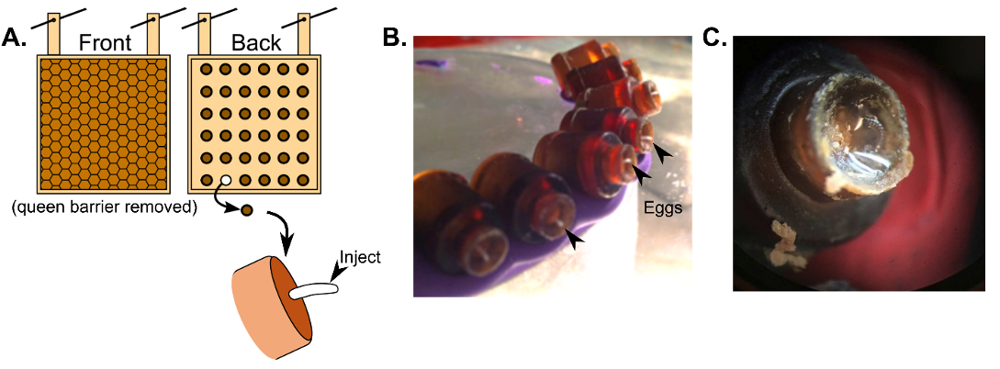

# 7. Functional genomics and xenobiotic treatment

## 7.2. CRISPR

Clustered regularly interspaced palindromic repeats and Cas9 (CRISPR/Cas9) gene editing is a relatively recent molecular tool for modifying the genome at very precise locations (Jinek et al., 2012). Knock-outs (removal of a large portion of a gene from the genome), knock-ins (insertion of an endogenous gene, a modified gene with altered expression, or a reporter), and targeted gene editing are all possible with the use of CRISPR. CRISPR has already been used to study the role of major royal jelly proteins (X. F. Hu et al., 2019; Kohno et al., 2016), taste (Değirmenci et al., 2020), development (Kohno & Kubo, 2018), neurodevelopment (Chen et al., 2021), and mechanisms of sex-determination (Roth et al., 2019; Wang et al., 2021) in honey bees. It is not, however, the only method of manipulating gene expression; other approaches are discussed in McAfee *et al.* (2022).

CRISPR technology relies on a well-designed short guide RNA (sgRNA) sequence to target a specific region of the genome. This sgRNA must include the following components:

-   A tracr RNA sequence, which creates a hairpin to act as a scaffold for Cas9 binding

-   A crRNA (CRISPR RNA) sequence (17-20 bp) which is specific to the target DNA

Constructs can be designed manually or utilizing a web-based tool. Several such tools exist, but many do not currently query against the *A. mellifera* genome. However, the tool [**Cas-OFFinder**](http://www.rgenome.net/cas-offinder) has this option. In addition, the region of interest within the genome must have a PAM (protospacer adjacent motif) sequence. This serves as a guide for the actual site of cleavage, which is 3-4 bp upstream of the PAM sequence. The following protocol for germline gene editing was inspired by (Chen, et al., 2021; Hu et al., 2019). Methods for egg collection and microinjection were originally developed by (Beye et al., 2002).

### 7.2.1. Considerations

-   Both Cas9 protein and sgRNA can either be purchased from vendors or expressed and purified in-house. The following protocol is for in-house expression. If purchasing components from vendors, skip to [Section 7.2.1.3]{.underline}.

-   This protocol describes injecting the gene editing components into honey bee eggs, but injecting into non-embryonic tissues (*e.g.* adult brains) is also possible.

-   Egg injections typically have a high failure rate and injecting thousands of eggs will likely be necessary to obtain an adequate number of mutants. To collect large numbers of fresh eggs, we recommend using the Jenter egg collection kit, which allows eggs to be conveniently collected on removable plastic plugs, although other methods are possible (*e.g.*, (Lee & Lee, 2019)). Condition queens by introducing them to the cages several days before injection day. You may need 3-5 laying queens to collect a sufficient number of fresh eggs.

-   Check with your institution’s Biosafety department for regulations around handling, maintaining, and disposing of genetically modified insects.

### 7.2.2. Materials

-   Large equipment: Incubators for bacterial culture and injected eggs, microinjector (*e.g.* PLI100 Pico injector (*Warner Instruments*) or Femtojet 4i (*Eppendorf*)), dissection scope, micromanipulator, basic laboratory equipment (microfuge, vortex, water bath, *etc.*), and a Nanodrop (*Thermo Fisher)* or Qubit (*Thermo Fisher*)

-   Kits: QIAprep plasmid purification kit (*QIAGEN*, or equivalent), T7 RiboMAX Express Large Scale RNA Production System (*Promega*), Monarch RNA Cleanup Kit (*New England Biolabs*, *Inc*)

-   Basic *E. coli* transformation and culturing reagents and materials

-   IPTG (IPTG (isopropyl β-d-1-thiogalactopyranoside)

-   Ni-NTA Superflow resin column (*QIAGEN*)

-   PD-10 column (GE Life Sciences)

-   BsaI restriction enzyme and digestion buffer

-   Cas9 storage buffer (20 mM Tris, pH 8, 200 mM KCl, 10 mM MgCl~2~, 10% glycerol)

-   Injection buffer (20 mM HEPES, pH 7.5, 300 mM KCl, 1 mM MgCl~2~)

### 7.2.3. Methods for CRISPR/Cas9 gene editing of embryos

#### 7.2.3.1. Generating Cas9 protein

1.  Obtain the plasmid pET-28b-Cas9-His (*Addgene*, *Watertown, MA*) for Cas9 expression under the control of the *lac* operator. Follow standard protocols for transformation, culturing, and IPTG induction in *E. coli* cells.

2.  Purify the His-tagged Cas9 from protein lysate with a Ni-NTA Superflow resin column.

3.  Desalt the Cas9 using a PD-10 column.

4.  Once eluted, Cas9 protein can be stored as a 50 μM solution in storage buffer at –80°C.

5.  For new batches, check Cas9 purity by gel electrophoresis.

#### 7.2.3.2. Generating sgRNA

1.  Ensure that equipment, surfaces, and reagents are nuclease-free.

2.  sgRNA cDNA can be inserted into a MiniGene plasmid (or equivalent plasmid for T7 *in vitro* transcription). Follow basic *E. coli* transformation and culturing protocols to increase plasmid copy numbers.

3.  Extract plasmid and purify using a plasmid QIAprep kit (*QIAGEN*) or equivalent.

4.  Linearize plasmid by digesting with BsaI (if using a MiniGene plasmid), or equivalent.

5.  Conduct *in vitro* transcription on linearized plasmid using the T7 RiboMAX Express Large Scale RNA Production System.

6.  Purify RNA with the Monarch RNA Cleanup Kit according to the manufacturer’s instructions for purification and storage.

7.  For new batches, check RNA integrity by gel electrophoresis and quantify using a Nanodrop or Qubit

#### 7.2.3.3. Ribonucleoprotein assembly

1.  Combine a 1:2 molar ratio of Cas9 to sgRNA, at a final concentration of 5 μM RNP, in injection buffer.

2.  This working solution can be split into 6 µl aliquots and frozen at –80 ℃.

3.  After thawing, dilute solution to 2.5 μM with injection buffer.

#### 7.2.3.4. Egg collection and microinjection

1.  Train queen in queen cages (*Jenter*™) (Figure 16A) by intermittently caging her for one day at a time. This will also give the workers a chance to build out the comb.

2.  On injection day, replace old egg plugs with fresh plugs. 2-4 h later, collect the freshly laid eggs by removing the plugs and fastening them to plasticine disks (Figure 16B).

3.  Keep eggs warm (30-33 ˚C) at all times or development will be delayed. Store in an incubator unless actively injecting. Perform injections in a walk-in incubator if possible.

4.  Load ~ 1 µl of RNP working solution into the injection pipet.

5.  Inject approximately 300-400 pL into the egg. Research has shown that injecting into the anterior third of the egg is most effective (Otte et al., 2018).

6.  Eggs should hatch about 72 h after injection. A few hours before hatching, prime the egg cups with a small amount of warmed royal jelly (Figure 16C). Remove cups with shriveled or deformed eggs.

7.  Once hatched, follow methods described in “Standard Methods for Artificial Rearing of *Apis mellifera* Larvae” (Crailsheim et al., 2013).

###### Figure 16. Examples of the Jenter egg collection system. A) Cartoon diagram of an egg collection cassette (not to scale, real cassette has 110 plugs). Image adapted from McAfee et al. (2018) (CC BY 4.0). B) Plugs with eggs fastened on modeling clay. C) Newly hatched larva primed with royal jelly.

