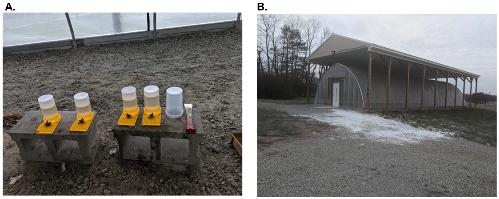

# 7. Functional genomics and xenobiotic treatment

## 7.4. Xenobiotic treatment

Treating bees with xenobiotic compounds is a quick and non-invasive means for modifying neurotransmitters and the activity of signaling pathways. In addition, it provides a convenient means for studying the impact of environmental chemicals (*e.g.* pesticides) on bee health. Most of the protocols below are described in Barron et al., (2007). Furthermore, additional types of compounds such as hormones and neurotransmitters can be used to treat bees and study their functions in behavior (Blenau & Baumann, 2016).

### 7.4.1 Xenobiotic treatment considerations

-   For any application, it is important to consider the realistic and relevant dosage. One way to determine this is to conduct assays with different xenobiotic concentrations and observe any changes in health or behavior which indicate that the chemical is active in the bee.

-   Depending on the goals of the experiment, the distribution of the chemical throughout the bee’s body may need to be monitored to confirm that it enters the tissue of interest. This has been done previously using radiolabeled chemicals (Barron et al., 2007) so that the radioactivity could be traced after administration.

-   Always follow chemical safety guidelines when working with pesticides and other chemicals that could be hazardous to human health

-   Many different drugs of interest can be taken up using this method, and requires very little reagent to see an effect. Serial dilutions will likely be necessary to generate solutions for application with precise concentrations.

-   The appropriate controls such as injection with saline should also be considered.

### 7.4.2. Materials

-   Large equipment: Dissection microscope, Hamilton syringe, flight cage, in-hive feeders or feeding stations

-   Insect Ringer solution (0.125 M sodium chloride, 1.5 mM calcium chloride dihydrate, 5 mM potassium chloride, 0.8 mM sodium phosphate dibasic, pH 7.4, filter sterilized)

-   High-purity xenobiotic compound

-   Organic solvent or water for to produce xenobiotic stock solution, depending on solubility

### 7.4.3 Procedure

#### 7.4.3.1 Thorax application

Different compounds may be soluble in different solvents. Acetone (Li-Byarlay et al., 2014) and dimethylformamaide (DMF) (Barron et al., 2007) have been previously described for topical applications. This is the simplest application method; however, actual absorption efficiency of most drugs through the cuticle is unknown.

1.  Anesthetize bees on ice or otherwise immobilize them for treatment.

2.  Apply 1 μl of solution containing the xenobiotic dissolved in organic solvent directly to the thorax of bees.

3.  Continue to immobilize bees for at least 30 seconds after application to allow for absorption and solvent evaporation.

4.  Analysis of phenotype (behavioral assay, dissection, genetic analysis) can be conducted 24 h after treatment.

5.  The amount of time suggested here may be different depending on the treatment and phenotypes.

#### 7.4.3.2. Injection

Injections allow very precise quantities of the drug to be directly administered to tissues or body sections of interest. This is especially useful for determining the action of a particular gene or signaling cascade in a specific location. However, this method requires specialized equipment, which the feeding methods do not. In addition, the person administering the drug must be incredibly careful when controlling the drug delivery to ensure that there is no damage to the bee in the course of the experiment.

1.  Dilute the xenobiotic stock solution in insect ringer solution to the desired concentration.

2.  Administer 1 μl of solution to each bee using a Hamilton syringe.

3.  Inject the bee.

    a\. For injections in the thorax, insert the needle at the base of the mesonotum to the right of the midline.

    b\. For injections into the head, the solution should be applied to the median ocellus. To do so, anesthetize the bees and place them on a strip of duct tape, such that the head is immobilized. Remove the lens of the median ocellus with a micro scalpel and apply 1 μl of the solution to this area. Confirm that absorption occurs over several minutes.

#### 7.4.3.3. Feeding individual bees

This method allows for control over the quantity of drug administered and allows for the researcher to control the time elapsed between the administration and any behavioral or genetic assay. However, administering drugs in this way can be very tedious and time consuming. It is also easier to damage bees in the course of collection, harnessing, and feeding.

1.  Prior to feeding, starve bees for 1-4 hours.

2.  Dissolve your drug of interest in a sucrose solution (50% w/v). **TIP:** Depending on the solubility of the chemical, a carrier solvent may be needed, such as lecithin or ethanol. If a carrier is used, it is crucial to take this into account when conducting vehicle controls.

3.  Immobilize bees in a 1.5 ml microfuge tube that has a hole made in the conical end.

4.  With a single bee in the tube with their heads towards the conical end opening, administer the drug in the sugar solution via pipette. Visually confirm that the bees are eating the solution. Bees can be fed up to 10 μl of solution in this way.

#### 7.4.3.4. Flight cage feeding

Although feedings are typically done in the laboratory, it is possible to conduct pharmaceutical feedings on a larger scale. However, a major concern when feeding colonies in the field is the potential for contaminating the environment with the drug being administered. One way around this is to utilize a closed system, such as a flight cage, where no other pollinators will be exposed. In a flight cage system (Figure 17), the drug of interest can be administered in a sucrose solution (1:1 weight/volume) using in-hive feeders or feeding stations (*Momowoa*). Food coloring can also be mixed with the sucrose solution, so that its ingestion can be observed in the bees.

This method enables researchers to feed compounds to an entire honey bee colony, without exposing the drug to other animals or plants. This method requires the installation of a specialized facility (the flight house), which can be expensive and time consuming. Because the bees can only eat food that is provided to them, fresh sugar solution and pollen must be provided daily. Food that isn’t replaced regularly might become moldy and toxic to the bees.

###### Figure 17. Setup for flight cage feeding. A) Bees are provided with a sugar water solution with the compound of interest. B) Flight cage enclosure is covered to protect from direct sunlight and rain.

