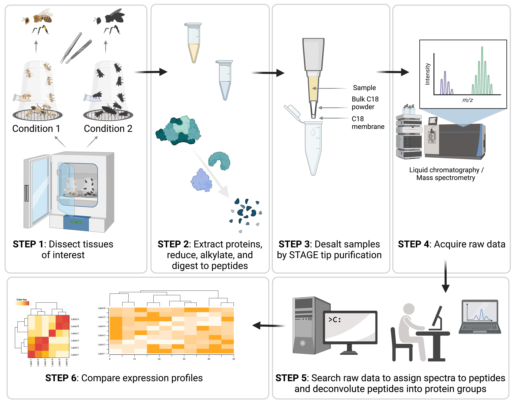

# 8. Proteomics

## 8.1. Introduction

While massively parallel sequencing enables high-throughput analyses of gene expression, transcripts are still one step away from the proteins that actually execute most biological functions. Gene and protein expression patterns are often not well correlated (Payne, 2015); therefore, transcriptomics and proteomics techniques are complementary. Diverse technologies have been used for proteomics over the years, including two-dimensional gel electrophoresis, mass fingerprinting, top-down proteomics, antibody microarrays, and shot-gun proteomics. Shot-gun proteomics has become the dominant technique, representing the vast majority of proteomics work done currently, andwill be the focus of the methods described here.

In this approach, proteins are first digested to peptides using proteases, then the peptides are ionized (acidified) and measured in a liquid chromatography-coupled tandem mass spectrometer (LC-MSMS) instrument. This type of instrument first measures the mass-to-charge ratio of a peptide ion, then fragments the ion and measures the mass-to-charge ratios of the fragments. These data can be used to identify the original peptide sequence, and bioinformatics tools are used to infer which proteins were present in the sample and in what quantities. Proteomics has historically lagged behind transcriptomics in terms of coverage and sensitivity (transcriptomics datasets typically quantify tens of thousands of genes, whereas proteomics datasets typically quantify several thousand proteins) (Timp & Timp, 2020), but improved liquid chromatography systems, instrumentation, and software have made proteomics competitively powerful (Aebersold & Mann, 2016).

Despite these exciting advances, it is still challenging to achieve rich proteomics datasets for honey bees relative to model species (McAfee et al., 2016). As with many non-model organisms, honey bees have undergone fewer iterations of genome annotation refinement than humans and model species, which hinders the ability of mass spectrometry data processing algorithms to assign spectra to peptide sequences. In a typical workflow (Figure 18), spectra can only be matched to known peptide sequences; therefore, proteome coverage is inherently sensitive to how precise and complete the genome annotation is. At the time of writing, the highest honey bee proteome coverage yet published in a single study is 4,604 unique protein groups (McAfee et al., 2021), obtained from unfractionated shot-gun analysis of n = 28 samples of eggs, but identifications more typically range from 1,000-3,000 protein groups (McAfee et al., 2016). Here, we outline the experimental procedure and data processing steps used to obtain this high-coverage dataset, although there are many potential variations on the protocol to fit different needs (*e.g.* alternate lysis buffers, digestion buffers, precipitation methods, peptide desalting approaches, chromatography systems, *etc.*). The following methods work well for most honey bee proteomics samples.

###### Figure 18. Schematic of a typical shot-gun proteomics workflow.
