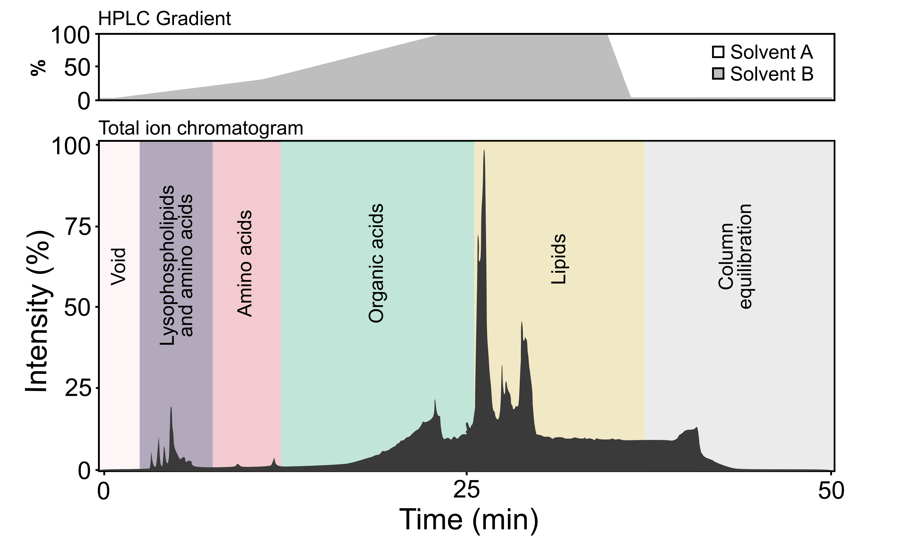

# 9. Metabolomics

## 9.3. Chromatography and mass spectrometry

Similar to proteomics (see [Section 8](https://youneedawiki.com/app/page/1b7KWanMG0j9WZf8sPiuy0Uex-05x-YWG?p=1rc183pyLOH9HstkT14kQP-SXKx-dffa2)), there are numerous options for chromatography and mass spectrometer instruments and acquisition methods. Additional considerations for chromatography and mass spectrometry are as follows:

1.  The methods described here have been used successfully with a Nexera LC30 UPLC (Shimadzu), coupled to a quadrupole-time-of-flight mass spectrometer (ABSCIEX TripleTOF 5600); however, other combinations are possible. High-resolution mass spectrometers require occasional calibration. Time of flight mass spectrometers (TOFs), for example, require calibration every 2 to 3 hours to retain < 3 ppm mass accuracy.

2.  The HPLC column is used to separate metabolites and other small molecules based on polarity (Figure 19). The LC-MS/MS approach described here has been used with an Inertsil Phenyl-3 stationary phase column (such as 150 mm × 4.6 mm, 5 µm by GL Sciences), but other columns may be better suited for analyzing different kinds of metabolites. Common columns include BEH C18 and ACQUITY HSS T3 (both manufactured by Waters) because they are suitable for analytes with a broad range of molecular weights and polarity.

3.  A guard column can be used to avoid unrecoverable column contamination. In case of contamination or sample impurities, the guard column can be discarded and replaced, thereby retaining the functionality of the HPLC column and extending its lifespan.

4.  For specialized small molecule analyses, an entirely different extraction and analysis method may be needed. Queen mandibular pheromone, for example, is typically extracted in ether, derivatized, and analyzed by GC-MS), rather than LC-MSMS, although a recent report does describe successful utilization of LC-MSMS for this purpose (McAfee et al., 2024). Some testing may be required to see which method works best for your target analytes. In addition, small and/or highly polar metabolites may not be compatible with reverse-phase chromatography; such compounds may require specialized chromatography techniques (e.g. hydrophilic interaction liquid chromatography, or HILIC; (Buszewski & Noga, 2012) or derivatization and analysis by GC-MS (De Souza, 2013).

5.  Data is normally acquired in data-dependent acquisition mode (DDA; also known as information dependent acquisition, or IDA). Survey scans are acquired followed by a specified number of MS/MS spectra in a given scan. This results in a “feature,” i.e., a mass, retention time, isotope ratio, and an MS/MS fragmentation pattern (Figure 20). In DDA mode, parent ion peaks are selected for fragmentation based on their intensities (ions producing the most intense peaks are selected). The number of ions that can be fragmented is finite and depends on the speed of the instrumentation. Data-independent acquisition (DIA) is also available for metabolomics analysis, and although it results in lower spectrum quality than DDA, DIA appears to be more precise and has better fragmentation spectrum coverage (Guo & Huan, 2020).

6.  Sample injections should always be randomized. In addition, blanks and QCs should be run at the beginning, during, and at the end of injection sequences to help correct for drifting signal intensities. This is especially important for large batch metabolomics.

7.  Gradients for metabolite elution may vary. This is experimentally derived to separate and optimize metabolite identification. For honey bee metabolomics, the following gradient has been successfully used (solvent A: 100% water containing 0.1% formic acid; solvent B: 100% methanol containing 0.1% formic acid): 0.0 min \@ 5% Solvent B; 1 min \@ 5% solvent B; 11 min \@ 30% solvent B; 23 min \@ 100% solvent B: 35 Min \@ 100% solvent B; 37 min \@ 5% solvent B; 50 minutes stop chromatography. While gradients using methanol are common (e.g. Zhang et al., 2022; Liu et al., 2023, McAfee et al., 2024), it may also be appropriate to use acetonitrile (e.g. Shi et al., 2018; Paten et al., 2022; Wu et al., 2024; Zhong et al., 2024) and additives such as ammonium formate (e.g. Xu et al., 2024), or ammonium acetate and ammonium hydroxide (e.g. Ma et al., 2024), depending on the chemical properties of the analytes to be separated. Refer to the vendor instructions when choosing the column and guard column, flow rate, solvent composition, and column cleaning tips. A GL Sciences Phenyl 3 column (4.6 x 150mm, 5 uM particle size) was used for this metabolomics profile.

###### Figure 19. Example of the chromatographic profiles TIC (total ion chromatogram). Typical compound classes; amino acids, lipids and organic acids are identified in the different regions during the HPLC gradient.

###### Figure 20. Description of an IDA (information dependent acquisition) feature. A) A total ion chromatogram of all ions detected in the sample. Each ion (feature) has a corresponding B) Extracted ion chromatogram (in this case, for the 205.10 parent ion), C) Survey spectrum scan containing the ion at a given retention time, and D) Fragmentation spectrum for the given parent ion and retention time.

