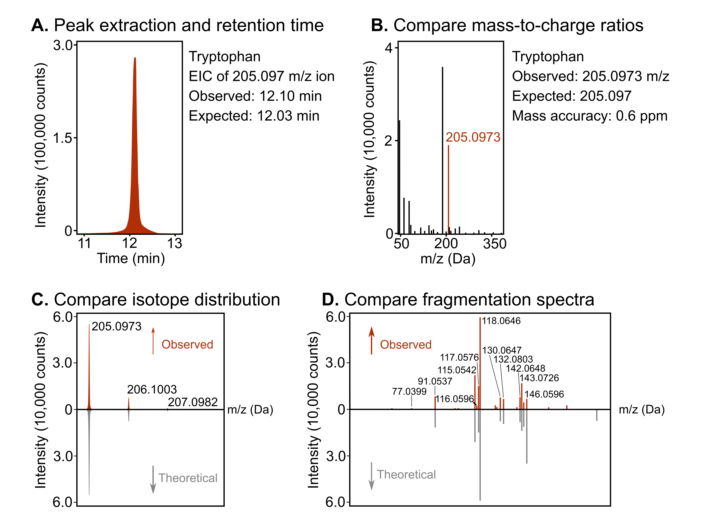

# 9. Metabolomics

## 9.4. Metabolomics data processing

The essential steps of metabolomics data processing that are required ahead of statistical analysis are peak picking (selecting chromatographic peaks), alignment (correcting for shifts in retention times), deconvolution (separating composite spectra from co-eluting analytes), integration (calculating peak areas), normalization (correcting for variation in sample injection amounts), and database querying/searching (annotating peaks with compound identities). The final result of these processing steps is a data matrix of samples and high-confidence compounds with their intensities that can be used for statistical analysis (differential abundance testing, pathway enrichments, etc.).

These informatic tasks can only be achieved with the help of specialized software (see Chen et al. (2022) for an outline of workflows and software options), which may include either commercial vendor software, free software available online, or a combination of both. In some cases, all essential data processing steps can be achieved within one software platform, whereas others may require a combination of tools (see below for examples). Regardless of the workflow employed, users should be familiar with the minimum reporting criteria outlined by the Metabolomics Standards Initiative before commencing (Spicer et al., 2017; Sumner et al., 2007).

Examples of paid software include **Peakview** (AB SCIEX) for peak visualization and compound identification, and **MultiQuant** (AB SCIEX) for feature integration, among other instrument-specific options. **Progenesis QI** (Waters, Nonlinear dynamics) is another popular paid software that can achieve all aspects of raw data processing when accompanied by the **METLIN** (discussed further below) plugin for database querying. **Reifycs** is another cross-instrument paid software option which supports various data formats and negates the need to purchase dedicated software for each mass spectrometry instrument.

Freely available software is also highly regarded in the field and can be used to process data from many types of instruments, provided the raw spectrum data files can be converted to the required input format. For example, [**MetaboAnalyst**](https://www.metaboanalyst.ca/) is one of the most widely used metabolomics data processing tools and can be used for several raw data types, once converted from the vendor data format to NetCDF, mzXML, or mzDATA format. The newest release of **MetaboAnalyst** (v. 6.0) includes updated processing and peak annotation modules for fragmentation (MS/MS) spectra and more sophisticated downstream statistical analysis modules (Pang et al., 2024). **MSDial** is another popular tool for raw data processing, which requires data in analysis base file (ABF) format (Tsugawa et al., 2015). The task of converting data files to the formats required by different software can be achieved using open-source tools available through [ProteoWizard](https://proteowizard.sourceforge.io/) or tools such as **Reifycs Abf** (for conversion to ABF format; available at <https://www.reifycs.com/AbfConverter/index.html>).

The ultimate goal of metabolomics is to identify and quantify small molecule metabolites in a biological system, so, clearly, the task of assigning spectra to correct compound identities is critical. After peak picking, alignment, deconvolution, integration, and normalization, metabolites are tentatively identified by matching their masses, fragmentation patterns, isotope distributions, and retention times (Figure 21), to corresponding data from an in-house chemical library, *in silico* library, or both. An in-house chemical library is a purchased set of metabolite standards (e.g., the IROA library) that are used to acquire reference data using the same conditions as the metabolomics HPLC gradient, whereas an *in silico* library is a database of spectra and compound identities (which should be derived from the same instrumentation used to acquire the experimental data). Examples of online *in silico* resources include [**METLIN**](https://metlin.scripps.edu/), [NIST17](https://chemdata.nist.gov/), MassBank Europe ([mass spectral database of Europe](https://massbank.eu/MassBank/)) and MoNA MS/MS libraries ([MassBank of North America](https://mona.fiehnlab.ucdavis.edu/)) (Ardalani et al., 2021). The METLIN database used to be publicly available (Guijas et al., 2018), but the updated version (XCMS-METLIN) is now behind a paywall. NIST17 is also a paid resource, with mass spectral libraries as well as various software tools that are needed to analyze the datasets. MoNA is a free database currently housing over two million mass spectral records from multiple data sources, such as experimental libraries with established datasets, in silico libraries, as well as information sourced from general user contributions. Regardless of the software or libraries used, it is essential to manually check each feature’s integration and qualifying attributes before including them in the list of tentatively identified metabolites, otherwise the risk of misassignment is high.

###### 

###### Figure 21. Example of methodology for tentative metabolite identification. Tryptophan is used in this example. A) The extracted ion chromatogram is compared with an established HPLC method library with known retention times for the metabolite of interest. B) The survey spectrum to compare mass measurements. Mass error should be less than 5 ppm. In this example the mass error is 0.6 ppm. C) Isotope pattern. The theoretical isotope distribution for tryptophan is compared to the observed isotope ratio. D) Library MS/MS spectrum matching. Observed MS/MS is compared to the IROA library MS/MS spectrum for tryptophan.

Once the data are extracted and in “.xls” or “.csv” format, a wide range of statistics and visualization methods can be used, such as producing heat maps, hierarchical clustering, principal component analysis, and correlation matrices, or performing comparisons using t-tests or ANOVAs (with multiple hypothesis testing corrections), *etc*. These statistical approaches are essentially the same as for other high-throughput biological data, such as proteomics or RNA-seq. To visualize data (as, e.g., PCA plots, heat maps, dendrograms, *etc.*), analytical software such as **MarkerView** (AB SCIEX) or **Progenesis QI** can be used. As mentioned earlier, the freely available software **MetaboAnalyst, which** enables a user to directly upload mass spectrometry files to the online platform, is especially appealing with its updated statistical analysis module (it can now handle more complex experimental designs) and new module for estimating causal relationships between metabolites and phenotypes (Pang et al., 2024). This software can also compute pathway analysis, enrichment analysis, biomarker analysis, network analysis, joint pathway analysis, and has an associated package for use in R (MetaboAnalystR; (Chong & Xia, 2018)). Please see Chen et al. (2022) for additional statistical analysis workflows and methods.

