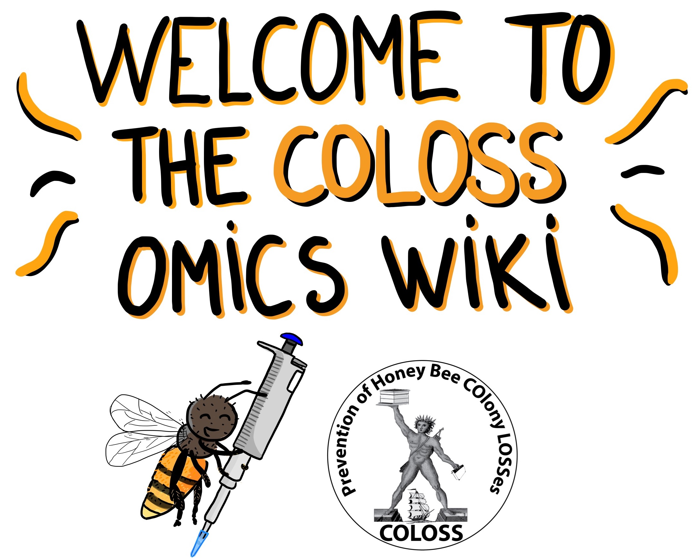

#

This online resource is part of the chapter **“Standard methods and good practices in Apis honey bee ‘omics research”** from the BEEBOOK volume IV. 

This collaborative work has been developed by 16 honey bee experts, which you can learn more about in the **[Meet the Team](https://maevatecher.github.io/standard-methods-apis-omics/theteam/)** section.

You can easily navigate between each section using the **table of contents** on the left side.

---

### Citation

Please cite the methods and tutorials described here as:

> “Techer et al., Standard methods and good practices in Apis honey bee omics research, Journal of Apicultural Research TJAR (in press)"