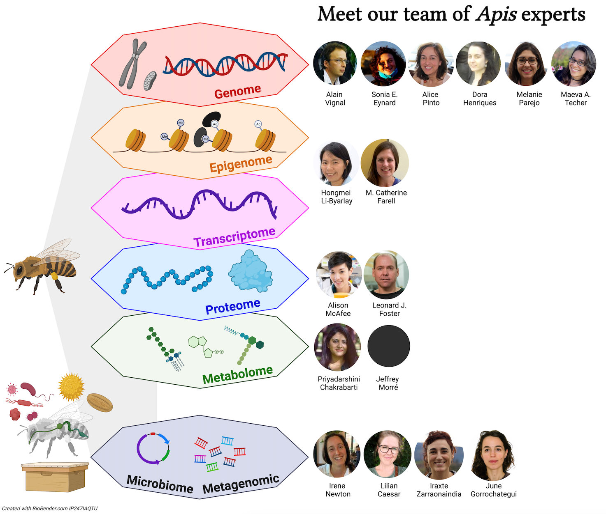

# 

# COLOSS Editor:

## Jay D. Evans

USDA-ARS, Bee Research Lab, BARC-E Bldg 306, Beltsville MD 20705, USA.

[Short Bio: -]

# Authors short bio (by alphabetical order):

## Priyadarshini Chakrabarti

Washington State University affiliation Department of Entomology, Washington State University, Pullman, WA 99164, USA

### Expertise: Metabolomics, proteomics, lipidomics, *Apis mellifera*

Priya is an Assistant Professor at the Department of Entomology at Washington State University. Priya is also a courtesy faculty at Oregon State University. Priya studies the interactive impacts of multiple stressors on bees, for example poor nutrition, pesticides, and climate change. She uses a wide array of multidisciplinary techniques across fields such as physiology, toxicology, functional biology, multi-omics approaches, and neuroethology to address her research questions. She is currently serving as the secretary/treasurer of the American Association of Professional Apiculturists, the North American Chair of the COLOSS bee nutrition taskforce and is the Vice-President Elect of the PBT Section of the Entomological Society of America. She also served as the chair of the Early Career Professionals Committee of the Entomological Society of America. In addition to the research community, Priya enjoys working with stakeholders, policymakers and the general community in protecting bee pollinators and raising pollinator awareness. She is also a children's book author who engages young readers and helps protect pollinators. More information about her research can be found on her lab’s website.

## Lílian Caesar

Department of Biology, Indiana University, Bloomington, Indiana, USA

### Expertise: Omics, microbiomes, ecology and evolution of symbiosis, host-microbe and microbe-microbe interactions, honey bees, and stingless bees

Lílian earned her PhD at the Universidade Federal do Rio Grande do Sul, Brazil. Currently she is a postdoctoral fellow in the Newton Lab, Department of Biology, at Indiana University, Bloomington. Her research focuses on the eco-evolutionary dynamics of symbiosis, and the impact of symbionts for host health. Her model system is the highly eusocial bees, i.e. honey bees and stingless bees. Lílian is interested in characterizing and studying microbiomes, including bacteria, fungi and viruses associated both with the adult bees, the brood in development and hive environments. For her investigations, Lílian combines multi-omics, in vitro/in vivo microbiology assays, and field work.

## Sonia E. Eynard

GenPhySE, Université de Toulouse, INRAE, INPT, INP-ENVT, 31326 Castanet Tolosan, France Labogena DNA, 78353 Jouy-en-Josas, France

### Expertise: Population genomics, quantitative genetics, livestock species, *Apis mellifera* 

As an undergraduate, Sonia studied wildlife conservation and the use of population genetics to advise on conservation strategies. In 2018 she graduated with a PhD in Animal Breeding and Genetics from the Erasmus Mundus project EGS-ABG with a double diploma from Wageningen University and AgroParisTech, where she looked into ways to mitigate the impact of selection on genetic diversity in livestock using next generation sequencing data. After completing her PhD she joined INRAE, in Toulouse, to work on the BeeStrong project. The aim was to identify genetic markers linked to resistance to *Varroa destructor* infestation in the French *Apis mellifera* population using pool sequencing experiments. She also contributed to a population genomics project to better understand and describe the genetic diversity observed in the European bee populations. Always fond of analysing new data and developing new methods, in 2023 she moved to a new postdoctoral position working on epigenetics and how it can be included in current breeding decisions in livestock species. Very much in love with honey bees, she hopes to be able to develop her own research line using new data and methods to answer challenges faced in honey bee genomics.

## M. Catherine Farrell

Agricultural Research and Development Program, Central State University, Wilberforce, OH

### Expertise: Behavior, single cell transcriptomics, neurobiology, *Apis mellifera* 

Catherine is a Research Assistant Professor of bee genomics at Central State University. As an undergraduate, her primary research interests were in the transcriptional regulation of circadian clock genes in *Xenopus* frogs. As a graduate student, her dissertation research focused on *Drosophila* neurobiology. In particular, she studied the role of serotonin in sensorimotor plasticity, and applied the diverse tools available within the *Drosophila* model system to look specifically at the neural circuitry underlying coordinated crawling behavior. After taking some time off after gaining her PhD in 2015 to teach, she joined Central State as a postdoctoral fellow, where she utilized transcriptomics, single cell transcriptomics, and epigenomics to understand honey bee grooming behavior.

## Leonard J. Foster

Department of Biochemistry and Molecular Biology, Michael Smith Laboratories, University of British Columbia, Vancouver, BC V6T1Z4, Canada

### Expertise: Proteomics, bioinformatics, *Apis mellifera* and many other model systems

Leonard is a Professor in the Department of Biochemistry and Molecular Biology at the University of British Columbia. Dr. Foster comes from a family of beekeepers and got his introduction to academic bee research while doing his Bachelor’s degree in biochemistry at Simon Fraser University, where he worked with Drs. Winston and Slessor on honey bee pheromones, particularly the components of queen mandibular pheromone. He then completed a PhD in Toronto and a postdoctoral fellowship in Denmark before starting his current position in 2005. The first independent operating grant that Dr. Foster secured was to study how bee pathogens were able to manipulate the protein machinery within bee cells. Since that time he has led three very large-scale projects that have investigated some of the molecular mechanisms behind disease resistance in bees. This effort has recently moved into trying to apply this knowledge by using this information to guide selective breeding for hygienic behavior in honey bees. He is very active in extension and frequently engages the public on various aspects of honey bee biology.

## June Gorrochategui-Ortega

Department of Genetics, Physical Anthropology and Animal Physiology, Applied Genomics and Bioinformatics lab., University of the Basque Country (UPV/EHU), Leioa, Spain

### Expertise: Bioinformatics, metagenomics, *Apis mellifera* 

June is a PhD student at the Applied Genomics and Bioinformatics group, at the Department of Genetics, Physical Anthropology and Animal Physiology of the University of the Basque Country (UPV/EHU, Spain). She is currently working on her PhD thesis (Basque Government PhD student grant), entitled “Identification of microbial profiles to promote colony health: towards the reduction of chemical residues in Apiculture (ERLEMIKRO)”. Her research aims to identify and characterize the microbial taxonomic and functional diversity of honey bee hive, for the identification of profiles that harbor symbiotic properties beneficial for honey bee health; by using metagenomics and metatranscriptomics.

## Dora Henriques

Centro de Investigação de Montanha, Instituto Politécnico de Bragança, Campus de Santa Apolónia, 5300-253, Bragança, Portugal

Laboratório Associado para a Sustentabilidade e Tecnologia em Regiões de Montanha (SusTEC), Instituto Politécnico de Bragança, Campus de Santa Apolónia, 5300-253 Bragança, Portugal

### Expertise: Population genomics, bioinformatics, conservation genomics, *Apis mellifera* 

Dora is a junior researcher at the Mountain Research Centre (CIMO) and at the Associated Laboratory for Sustainability and Technology in Mountain Regions (SusTEC). She completed her PhD in Molecular and Environmental Biology at Minho University in 2018 with the thesis entitled “Employment of whole genome resequencing to reveal the evolutionary history and to develop molecular tools for Western European honey bees (*Apis mellifera* subspecies)”. Her main research interests are honey bee evolution and the development of molecular tools for honey bee conservation. She has collaborated on eight research projects, publishing over 20 peer-reviewed scientific articles and 15 popular articles, while also presenting over 90 conference papers. She is a member of the editorial board of the Journal of Apicultural Research (JAR).

## Hongmei Li-Byarlay

Agricultural Research and Development Program, Central State University, Wilberforce, OH Department of Agricultural and Life Sciences, Central State University, Wilberforce, OH

### Expertise: Transcriptomics, epigenomics, functional genomics of honey bees 

Hongmei is currently an Associate Professor at Central State University in the State of Ohio (U.S.A). Her doctoral degree is in entomology from Purdue University (Indiana) where she studied the genetics and physiology of Drosophila melanogaster with Drs. Barry Pittendrigh and Larry Murdock. She then worked at the University of Illinois at Urbana-Champaign (UIUC) and at North Carolina State University for her postdoctoral research. Since 2010, she has conducted her research on bee behavior, genetics, molecular biology and physiology. In 2017, she started her own lab’s research in honey bee functional genomics, transcriptomics, epigenomics such as DNA and RNA methylation, molecular mechanisms underlying social behaviors, selection and breeding for mite resistant stocks, oxidative stress and aging. She has published 40+ peer-reviewed papers and book chapters. She has presented 100+ talks for research, education, extension, outreach to different communities. Her research lab received funding support from the National Science Foundation and U.S. Department of Agriculture. More information can be found on her lab’s website and her Google Scholar page.

## Alison McAfee

Department of Biochemistry and Molecular Biology, Michael Smith Laboratories, University of British Columbia, Vancouver, BC V6T1Z4, Canada

Department of Applied Ecology, North Carolina State University, Raleigh, NC 27695-7617, USA

### Expertise: Proteomics, queen biology, *Apis mellifera* 

Alison completed her PhD in Genome Science and Technology at the University of British Columbia in 2018. She is now a postdoctoral fellow and uses mass spectrometry to study how extreme temperatures associated with climate change are affecting honey bee and bumble bee fertility and survival. Alison also loves science communication, and has published 90+ magazine articles for publications including Scientific American, American Bee Journal, Conversation Canada, and UBC Magazine. Her research has been covered by outlets such as New Scientist, National Geographic, Science Friday and Scientific American, among others. In 2022, Alison received the L’Oreal-UNESCO for Women in Science International Rising Talents award for North America, becoming one of fifteen top female scientists globally who are recognized for their leadership and research each year.

## Jeffrey T. Morré

Department of Chemistry, Oregon State University, Corvallis, OR 97331 USA

### Expertise: Biological mass spectrometry 

Jeffrey has 26 years of mass spectrometry experience. Jeffrey's current position is operations manager for the Oregon State University Mass Spectrometry Center.

## Irene L. G. Newton 

Professor of Biology, Department of Biology, Indiana University, Bloomington, Indiana, USA

### Expertise: Host-microbe interactions, microbial genomics, microbiomes 

Irene is a Professor of Biology at Indiana University, Bloomington where she studies mechanisms of host-microbe symbiosis. One of her model systems is the honey bee microbiome, where she focuses on understanding the composition of the community and its function.

## Melanie Parejo

Department of Genetics, Physical Anthropology and Animal Physiology, Applied Genomics and Bioinformatics lab., University of the Basque Country (UPV/EHU), Leioa, Spain

### Expertise: Population genomics, bioinformatics, *Apis mellifera* 

Melanie has a life science background, holding a master's degree in Ecology and Evolution from the Swiss Federal Institute of Technology, Zurich, (ETHZ). She also holds a PhD in Biochemistry and Molecular Biology (2017) from the University of Bern, Switzerland, in collaboration with the Swiss Bee Research Center, Agroscope, the topic of her thesis being “Honey bee Conservation and Population Genetics using Whole-Genome Sequence Data”. With a postdoctoral fellowship from the Swiss National Science Foundation, she now works at the University of the Basque Country (UPV/EHU), where she continues to study honey bee genomics. Since 2018, she has been the Assistant Editor of the Journal of Apicultural Research, published on behalf of the International Bee Research Association. Her interests lie in applied genomics in apiculture, diagnostic molecular tools, conservation, ecology and hologenomics. Findings of her research have led to new and adapted management practices such as increasing the hybridization threshold for native honey bees in conservation areas, genetic monitoring tools such as a high-throughput introgression test for bee breeding based on single-nucleotide polymorphisms (SNPs), a subspecies diagnostic SNP chip to classify European subspecies, and a SNP-based paternity assignment test to be employed in the evaluation of breeding mating stations’ efficiency.

## M. Alice Pinto

Centro de Investigação de Montanha, Instituto Politécnico de Bragança, Campus de Santa Apolónia, 5300-253, Bragança, Portugal

Laboratório Associado para a Sustentabilidade e Tecnologia em Regiões de Montanha (SusTEC), Instituto Politécnico de Bragança, Campus de Santa Apolónia, 5300-253 Bragança, Portugal

### Expertise: Population genomics, *Apis mellifera* 

Alice is a Professor at the Polytechnic Institute of Bragança (IPB) and a researcher at the Mountain Research Centre (CIMO), Portugal. She earned a doctoral degree in entomology from Texas A&M University in the United States. She developed a keen interest in honey bees during her PhD research, while studying a fascinating feral population living in oak tree cavities. For her PhD dissertation, she examined the genetic changes in this population undergoing Africanization. Currently, her main research interests involve uncovering the processes that shape extant genetic diversity patterns in honey bee populations, with a particular focus on understanding the basis of local adaptation. She has coordinated and collaborated in over 15 national and international research projects funded by the Portuguese Science Foundation and the European Commission. These projects have dealt with a wide array of subjects, such as: (i) the genomics of *Apis mellifera* to the genetics of its predators (*Vespa velutina*) and diseases (viruses and nosemosis), and (ii) the development of SNP-based assays and ML-based software for honey bee identification, and (iii) the botanical identification of bee-collected pollen via ITS2-metabarcoding. She has published over 60 peer-reviewed scientific articles, 40 popular articles, and presented over 250 conference papers. She is a member of the editorial board of Scientific Reports, Insects, and Frontiers in Bee Science.

## Maeva A. Techer

Okinawa Institute of Science and Technology, 1919-1 Tancha, Onna-son,904-0495 Okinawa, Japan

Texas A&M University, Department of Entomology, College Station, USA

Behavioral Plasticity Research Institute, NSF-BII, USA

### Expertise: Population Genomics, Comparative genomics, Transcriptomics, *Apis mellifera*, Varroa destructor 

Maeva joined the Behavioral Plasticity Research Institute as a Postdoctoral Researcher and has been based at Texas A&M University since 2021. While her current research focuses on locust phase polyphenism, she is dedicating herself to learning how to bridge the gap between disciplines and find shared evolution in diverse arthropods to contribute to the new generation of integrative biologists. She completed a PhD in Population Genetics on insular native honey bees evolution at the University of Reunion Island (where she was born). There she learned to combine classical population genetics and demographic inferences to retrace the origins of modern populations and understand which factors shaped their evolution over time. She started using whole genome sequencing during her postdoctoral position at the Okinawa Institute of Science and Technology in Japan, where she focused on the most detrimental honey bee parasites: Varroa mites. Her research seeks to understand how species and populations can rapidly respond and adapt to environmental changes by generating and maintaining variability.

## Alain Vignal

GenPhySE, Université de Toulouse, INRAE, INPT, INP-ENVT, 31326 Castanet Tolosan, France

### Expertise: Population and comparative genomics, QTL mapping, poultry, *Apis mellifera* 

Alain obtained his PhD in molecular biology from Orsay University (France) in 1991. His first expertise was on sequencing genes coding for human blood groups and building genetic maps for locating markers linked to monogenic diseases. He now works at INRAE in Toulouse, France, where he first worked on QTL mapping in chickens and was subsequently involved in the consortiums for the assembly of reference genomes of several poultry species. First the chicken in 2004 (Sanger sequencing) and helping with updates until 2017, then the mallard duck, Muskovy duck, quail, and guinea fowl. With the establishment of short-read parallel sequencing and long-read sequencing as new standards, population genomics at the genome scale became possible, which he did in guinea fowl and now in honey bees. His main focus is to better understand the genetic diversity and admixture in European honey bee populations and to deepen our understanding of the honey bee genome structure.

## Iratxe Zarraonaindia

Department of Genetics, Physical Anthropology and Animal Physiology, Applied Genomics and Bioinformatics lab., University of the Basque Country (UPV/EHU), Leioa, Spain IKERBASQUE, Basque Foundation for Science, Bilbao, Spain

### Expertise: Bioinformatics, metagenomics, *Apis mellifera* 

Zarraonaindia is an Ikerbasque Research Associate at the Department of Genetics, Physical Anthropology and Animal Physiology of the University of the Basque Country (UPV/EHU, Spain) since 2021. She conducted her postdoctoral research (2012-2015) at the Bioscience Division of Argonne National Laboratory (Chicago, USA), where she acquired ample expertise on environmental microbiology and NGS bioinformatics by joining a massively collaborative project that aimed to characterize microbial life on Earth (The Earth Microbiome Project). In 2016 Zarraonaindia joined the Applied Genomics and Bioinformatics group at UPV/EHU, recently becoming the lead investigator. Her current research interest is implementing NGS approaches for the investigation of the impact of anthropic activities on apiculture, by better understanding microbe-bee interactions and how microbes influence honey bee disease resistance, working towards environmentally friendly alternatives to agrochemicals. She teaches “Bioinformatics and omics” classes at several master’s programs and has participated in 3 European, 1 national and a local research project to unravel the contribution of landscape, environment, management, genetics, and microbiota in honey bee health.
