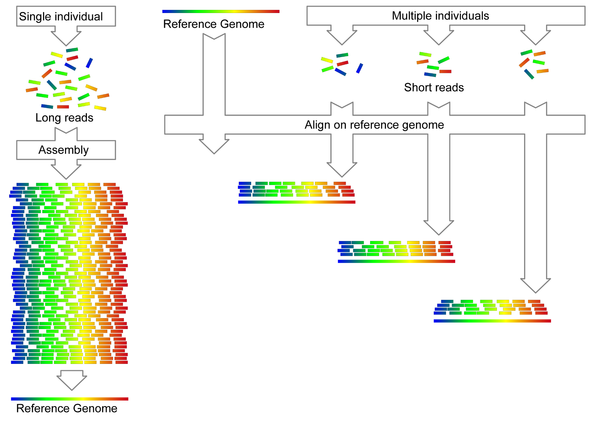

# 3. Genome sequencing

## 3.1. Introduction

As for other species, the sequencing of *Apis* DNA has many applications that can be divided into three categories: *de novo* sequencing, resequencing, and transcript sequencing. While the last category technically relies on sequencing cDNA reads, its use is intended to inform the structure and expression of genes in honey bee genome, a topic that is covered in [Section 6](https://youneedawiki.com/app/page/1xCroRTPWU4mk711qSP4X6GCmIwLz9PdB?p=1rc183pyLOH9HstkT14kQP-SXKx-dffa2).

*De novo* sequencing of *Apis* species started in 2006 but is punctually used to generate improved reference genomes and to represent new subspecies (see Figure 2) (Toth & Zayed, 2021). To achieve successful *de novo* sequencing, the utilization of the most advanced technology available is necessary.The longest possible reads should be produced, possibly from one single sample, and these will be assembled into contigs based on partial sequence overlap (Figure 3A). In turn, these contigs will be assembled using other mapping methods such as optical maps or Hi-C, to reconstruct larger fragments (scaffolds), aiming at a chromosome-level assembly.

Further analyses, such as population genomics or RNA-seq, may then use the reference genome produced by *de novo* sequencing. This is done by aligning reads produced with a high-throughput method, such as *Illumina* short-read parallel sequencing, to the reference. Using a single reference genome for a community of users allows the comparison of results by having a unique coordinate system. For instance, population genomics studies on whole genomes are conducted by a re-sequencing approach in which the reads from one sample are compared to a reference by alignment (Figure 3B). Re-sequencing with short reads will detect small differences such as single nucleotide polymorphisms (SNPs) or insertion-deletion mutations (indels), whereas a long-read approach will highlight larger structural variants. Alignment of sequence reads to a reference is also used for a variety of other analyses, such as the detection of DNA methylation (bisulfite sequencing) (Lyko et al., 2010), identifying regulatory regions linked to histone modifications (ChIP-seq) (Nakato & Sakata, 2021) the analysis of the 3D conformation of chromosomes in the interphase nucleus (Hi-C) (Hoencamp et al., 2021; van Berkum et al., 2010), and many other applications.

Different sequencing techniques exist, and the choice amongst the three main categories (Sanger sequencing, short read parallel sequencing, and long-read sequencing) will depend on the desired goal. Due to the broad applications of sequencing and the constant progress made by technology, we will only cover the most common ones as quick guides toward informed choices here. For reviews on the three main sequencing technologies, see (Heather & Chain, 2016; Shendure et al., 2017).

###### Figure 3. Genome sequencing. A) Sequence reads are assembled into contigs by partial sequence overlap. B) Alignment of reads to a reference genome. These can be whole-genome sequencing, RNA-seq or other. Ideally, for a given Apis species, only one reference genome should be used by the community, allowing for a unique and common coordinate system for comparing results. Sequencing genomes usually refers to this method of looking for differences between the samples under study and the reference. The consequence is that all results are reference-biased. For instance, a gene absent in the reference genome cannot be analyzed in the samples, even when reads align to it.
