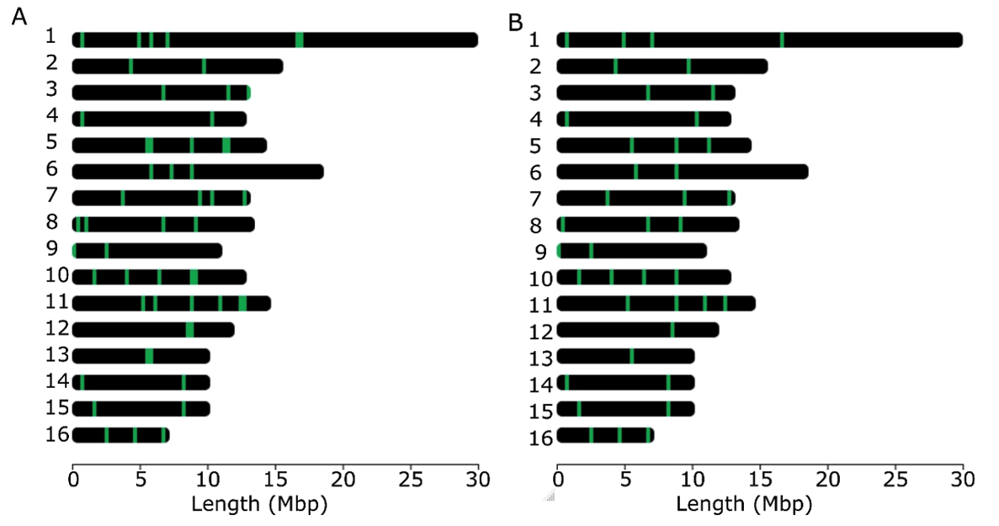

# 4. Whole-genome population and association studies

## 4.10. Applying population genomics to conservation: Reduced SNP analysis

Whole genomes provide important insights into the processes that shape diversity patterns (Chen et al., 2016; Cridland et al., 2017; Fuller et al., 2015; Harpur et al., 2014; Henriques et al., 2018; Nelson et al., 2017; Parejo et al., 2017; Parejo et al., 2020; Wallberg et al., 2014) and are offering unprecedented power for delving into fundamental apicultural questions (*e.g.,* tolerance and resistance to the ectoparasite *Varroa destructor*, introgression, *etc.*) (Harpur et al., 2019, 2020; Parejo et al., 2016; Saelao et al., 2020)), with potential implications for sustainable honey bee management. However, the adoption of whole genome approaches is hindered by the requirement for sophisticated laboratory and computational resources, as well as advanced bioinformatics expertise. Many molecular biology laboratories, conservation centers, and breeding facilities lack access to these resources, limiting the value of genomic data in these contexts. To address this challenge, experts can leverage whole genome data to develop reduced SNP-based tools, and these can be more easily employed by the broader honey bee community.

Panels containing a reduced number (\< 160) of highly informative markers have been designed from genome-wide SNPs (Muñoz et al., 2017) or from whole-genome data (Chapman et al., 2015; Henriques, Browne, et al., 2018) to address different goals such as (i) identifying Africanized honey bees (Chapman et al., 2015), (ii) estimating C-lineage introgression into the M-lineage *A. m. mellifera* and *A. m. iberiensis* subspecies (Henriques et al., 2018; Henriques et al., 2018; Muñoz et al., 2017) or (iii) monitoring diversity in immune genes (Henriques et al., 2021). All these reduced SNP panels have been tailored for genotyping in the MassARRAY MALDI-TOF platform, a cost-effective technology for a relatively small number of markers and a large number of samples. For example, in a single 384 SpectroCHIP array, it is possible to genotype 384 samples with one SNP-plex (containing a maximum of 40 SNPs), 192 samples with two SNP-plexes, 128 samples with three SNP-plexes, 96 samples with four SNP-plexes, or other possible combinations of markers and samples to a maximum of 384, all for the same price. Additional technologies, such as Fluidigm microfluidic array, SNaPshot, and capture-based target enrichment methods, are also appealing for the development of genotyping tools because they also allow screening dozens to hundreds of SNPs in a cost-effective manner (Daca-Roszak et al., 2016; Emerman et al., 2017; von Thaden et al., 2020).

When the number of selected SNPs is in the order of thousands to tens of thousands, other technologies such as *Affymetrix* or *Illumina* *Infinium* are better suited for genotyping. These technologies have been used for genotyping highly dense SNP panels with varying purposes, including genome-wide association screening for hygienic behavior (\~44,000 SNPs) (Spötter et al., 2016), identification of honey bee subspecies (\~4,000 SNPs) (Momeni et al., 2021), or genomic selection (\~100,000 SNPs) (Jones et al., 2020).

When developing a panel, the first step is to establish a clear goal that will guide the choice of SNPs to be included. For instance, if one wants to create a panel for screening populations for local adaptation, a selection analysis such as LFMM should be performed. However, if the goal is to identify introgressed populations, an admixture analysis with the focal subspecies should be performed. To develop a reliable molecular tool, it is important to start out with a powerful discovery panel, which should include a reasonable number of individuals that capture, as much as possible, the entire population diversity. Using *A. m. iberiensis* as the model organism (Henriques et al., 2018) demonstrated that, when employing a sample size \< 10 in the panel design and a sample breadth representing only a fraction of a population's genetic diversity, a bias is introduced in the informativeness of the markers. This finding implies that to develop a reliable reduced SNP panel, one must first understand the diversity patterns of the target population.

This section shows all the steps involved in developing a reduced panel tailored to distinguish M- from C-lineage subspecies. In this tutorial, the panel contains only 40 highly informative SNPs, the maximum plex size of the MassARRAY MALDI-TOF technology.

### 4.10.1. Materials

This section requires **PLINK** (see [Section 4.7](https://youneedawiki.com/app/page/1IUnW7oMAEYX0T5pebD3S0LaYgRaxJtc7d96HUFuaPa0?p=1rc183pyLOH9HstkT14kQP-SXKx-dffa2)), **CLUMPAK**, **ADMIXTURE** (version 1.3; see [Section 4.8](https://youneedawiki.com/app/page/1J8sNMbKOYmL25FY44_Zkoq5gqy08ndUkbKKW2A5QJa8?p=1rc183pyLOH9HstkT14kQP-SXKx-dffa2)), **snpEff** from Galaxy (see [Section 4.9](https://youneedawiki.com/app/page/1fcyQLbkY1cuafaqAMjef8pjcl_dZxPQ2yzIlE_-M6go?p=1rc183pyLOH9HstkT14kQP-SXKx-dffa2)), and the **R** package [**chromoMap**](https://cran.r-project.org/web/packages/chromoMap/vignettes/chromoMap.html#Getting_Started). The dataset used herein will be *pop_gen_MD_maf005*, which was created in [Section 4.7](https://youneedawiki.com/app/page/1IUnW7oMAEYX0T5pebD3S0LaYgRaxJtc7d96HUFuaPa0?p=1rc183pyLOH9HstkT14kQP-SXKx-dffa2)[.2.5]{.underline}. 

### 4.10.2. Methods

**Step 1.** Divide the dataset into training and holdout subsets, following Anderson’s method (Anderson, 2010). This is a critical step because if the informative SNPs are chosen and validated on the same individuals, an upward bias will be introduced. The training subset should contain 75% of randomly chosen individuals, which will be used to select the most informative SNPs. The remaining 25% of the individuals will make the holdout subset, which will be used to validate the SNP panel.

1\. Create a file with the holdout subset. The individuals should be chosen at random, but to follow the tutorial we provide the file called *holdou*t.

2\. Create the holdout subset containing only the individuals listed in the *holdout* file:

``` bash
plink --bfile pop_gen_MD_maf005 \
--keep holdout `#list of individuals to keep` \
--make-bed \
--out pop_gen_MD_maf005_holdout
```

3\. Create the training subset excluding the individuals listed in the holdout file:

``` bash
plink --bfile pop_gen_MD_maf005 \
--remove holdout `#list of individuals to remove` \
--make-bed \
--out pop_gen_MD_maf005_training
```

**Step 2**. Select the most informative SNPs from the training dataset. The main goal of the panel designed herein is to distinguish M- from C-lineage subspecies. Given that these two lineages are very divergent, it is expected to find many fixed SNPs (F~ST~= 1), which are the most informative ones.

1\. Calculate the F~ST~ values between C- and M- lineage for each SNP in the training subset (see [Section 4.7](https://youneedawiki.com/app/page/1IUnW7oMAEYX0T5pebD3S0LaYgRaxJtc7d96HUFuaPa0?p=1rc183pyLOH9HstkT14kQP-SXKx-dffa2)[.2.6]{.underline}*.* for further details).

``` bash
plink --bfile pop_gen_MD_maf005_training \
--fst --within within_M_C_ind_training \
--out pop_gen_MD_maf005_training
```

2\. Select the SNPs with F~ST~ = 1. First, the *awk* command will select the lines that have a value equal to one in the fifth column and, from these values, only the second column will be printed in the file *pop_gen_MD_maf005_training.fst_1*.

``` bash
 awk '{if($5 == 1){print}}'  
 pop_gen_MD_maf005_training.fst | \
 awk '{ print $2 }' > 
 pop_gen_MD_maf005_training.fst_1
```

**Step 3.** Apply filters to narrow down the number of discovered SNPs. In this tutorial example, a total of 416,123 SNPs exhibit an F~ST~ = 1. To narrow down this massive number, filters related to the panel goal must be applied. Here, only SNPs classified as having a high impact by **snpEff** will be retained. Other filtering criteria include linkage (SNPs that are physically linked may contain redundant information and can therefore be eliminated) and coverage of the 16 honey bee chromosomes. To investigate how the SNPs are distributed across the chromosomes, the R package **chromoMap** will be used. This package requires two files: the *chromosome_file.txt*, containing the chromosome coordinates, and the *high_impact.txt*, containing the genomic coordinates of the SNPs.

1\. Convert the *pop_gen_MD_maf005_training* PLINK 1 binary file to VCF format:

``` bash
plink --bfile pop_gen_MD_maf005 \
--extract pop_gen_MD_maf005_training.fst_1 \
--recode vcf --out FST1snps
```

2\. Using the methodology described in **Step 17** of the **LFMM** section ([Section 4.9](https://youneedawiki.com/app/page/1fcyQLbkY1cuafaqAMjef8pjcl_dZxPQ2yzIlE_-M6go?p=1rc183pyLOH9HstkT14kQP-SXKx-dffa2)), annotate the file *FST1snps.vcf* with **snpEff.**

3\. Download the annotated VCF file from Galaxy, here named *Galaxy21.vcf*.

4\. Create the annotation file to be used by **chromoMap**. The command *grep* will search and retrieve the lines that contain the string ‘HIGH’. From these lines, the command *awk* will print the third column (SNP name) followed by the first column (chromosome name) and the second one (genomic position) two times.

``` bash
grep 'HIGH' Galaxy21.vcf | \
awk '{ print $3"\t" $1"\t" $2"\t"$2 }' > high_impact.txt
```

5\. Visualize the SNPs distribution using **chromoMap** in R.

``` r
install.packages("chromoMap")
library(chromoMap)
chromoMap("chromosome_file.txt", "high_impact.txt", ploidy = 1)
```

6\. As depicted in Figure 13, some SNPs are located in close proximity to each other. Use **PLINK** to remove one of these linked SNPs by running the following commands:

a\. Create a SNP list with the SNPs annotated with a high impact

``` bash
grep 'HIGH' Galaxy21.vcf | \
awk '{ print $3}' > high_impact_list
```

b\. Create a PLINK 1 binary file containing only the high impact SNPs.

``` bash
plink --bfile pop_gen_MD_maf005 \
--extract high_impact_list \
--make-bed \
--out pop_gen_MD_maf005_high_impact_list
```

c\. Create a file excluding SNPs that are in the same genomic region. To have a final list of 40 SNPs, only loci that are at least 1,500 Kb apart will be selected (using the flag --bp-space).

``` bash
plink --bfile pop_gen_MD_maf005_high_impact_list \
--bp-space 1500000 \
--make-bed \
--write-snplist --out pop_gen_MD_maf005_high_impact_list_prunned
```

**Step 4.** Assay validation. Using the holdout subset, it is possible to assess whether the admixture proportions inferred from whole-genome data are similar to those obtained with the reduced SNP panel.

1\. Run **ADMIXTURE** following the steps detailed in [Section 4.8](https://youneedawiki.com/app/page/1J8sNMbKOYmL25FY44_Zkoq5gqy08ndUkbKKW2A5QJa8?p=1rc183pyLOH9HstkT14kQP-SXKx-dffa2) using all the SNPs in the holdout subset (file *pop_gen_MD_maf005_holdout*)

2\. Run **ADMIXTURE** for the holdout subset using only the highly informative SNPs (file *pop_gen_MD_maf005_high_impact_list_pruneddata*)

3\. Compare the results obtained in 1) and 2) by calculating, for instance, Pearson’s correlation (r).

In the tutorial example, all tested individuals were revealed to be pure (with no signs of introgression) and r = 1. If one wants to develop a reduced SNP panel for estimating introgression proportions, the panel should also be validated in admixed individuals.



###### Figure 13. Chromosome map showing the positions (green line) of the highly informative SNPs A) before and B) after linkage disequilibrium pruning.
