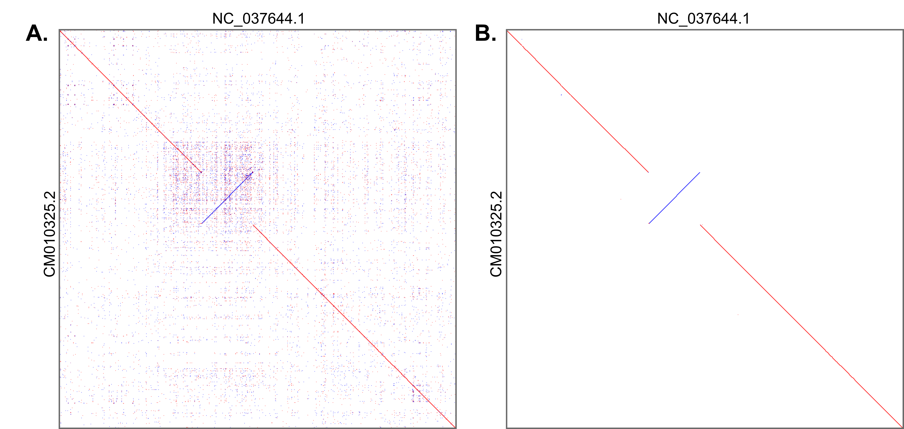

# 4. Whole-genome population and association studies

## 4.4. Comparing whole genomes

Comparing different versions of whole-genome assemblies can help assess their quality and identify major structural rearrangements occurring between individuals of the same species, from different subspecies, or different species. The rearrangements thus detected will be large deletions, insertions, inversions, or translocations. There are many software options for pairwise alignments, including **LAST** (Frith & Kawaguchi, 2015), **MUMmer** (Marçais et al., 2018) or, **minimap** (Heng Li, 2018), among others. These tools can also be used to align long-reads from *PacBio* *SMRT* (single-molecule real-time) sequencing technology or *Oxford Nanopore Technologies* (ONT) on reference genomes, thus enabling rearrangements to be detected directly after the assembly process. The case of simultaneous and multiple alignments is more complex and will not be described here (see currently developed methods (Armstrong et al., 2020; Kille et al., 2022) and large eukaryote dataset applications (Feng et al., 2020; Zoonomia Consortium, 2020)).

### 4.4.1. Conducting a pairwise genome comparison with LAST

The example of pairwise whole-genome comparison given here, using **LAST,** describes the main steps with default values for the options proposed being used as much as possible. Detailed information on the numerous options proposed by the software that can affect sensitivity, speed and other aspects are described in the [software documentation](https://gitlab.com/mcfrith/last/-/tree/main/doc). In the following example, we will compare the AMelMel genome assembly of the black bee *A. mellifera mellifera* (query sequence), to the reference genome HAv3.1 (target sequence).

**Step 1.** Both the target (HAV3_1.fa) and query (AMelMel_1.fa) sequences must be in FASTA format, in the form:

``` bash
cat AMelMel_1.fa
>Chromosome1
ACTACAGGATATCCATAGACAT…
>Chromosome2
GTCAGGATAGACAGGTAGACAT…
```

Use basic Unix commands such as cat or less to print the content of your target.fa and query.fa.

**Step 2.** Prepare index files for the target sequence with the command lastdb:

``` bash
lastdb -uNEAR HAV3_1Db HAV3_1.fa
```

**Note:** The option -uNEAR specifies a seeding scheme that is good for finding strong similarities. It is used here instead of the default YASS seeding scheme, as we are comparing two subspecies and therefore very similar sequences.

**Step 3.** Define an optimal scoring matrix. This is optional, as **LAST** can work with a default matrix or with one of the matrices provided. The command last-train will find suitable substitution and gap scores for aligning the two sequences provided by using an iterative procedure:

``` bash
last-train HAV3_1Db AMelMel_1.fa > score_matrix.mat
```

**Step 4.** Align the query to the target:

``` bash
lastal -p score_matrix.mat HAV3_1Db AMelMel_1.fa > HAv_Amel.maf
```

**Note:** The option -p score_matrix.mat specifies the score matrix prepared with last-train. Any built-in score matrix proposed by **LAST** can be used.

**Step 5.** Plot the original alignment results.We will only plot the alignment of chromosomes 7 (NC_037644.1 in the HAv3.1 genome and CM010325.2 in the AMelMel genome) (Figure 7A). The next steps will aim at finding a unique best alignment.

``` bash
last-dotplot -1 NC_037644.1 -2 CM010325.2 HAV3_1_AMelMel1_1.maf plot_chr7.png
```

**Step 6.** Finding unique best hits for the query. At this point, any sequence segment in the query can have several alignments in the target. The command last-split will read the candidate alignments of the query sequences, and looks for a unique best alignment for each part of each query.

``` bash
last-split HAV3_1_AMelMel1_1.maf > HAV3_1_AMelMel1_1_split1.maf
```

**Step 7.** Finding unique best hits for the target. As the sequence segments in the target HAv3.1 genome can also have several alignments in the query, query and target are inverted in the file, and last-split is run again:

``` bash
maf-swap HAV3_1_AMelMel1_1_split1.maf | last-split > HAV3_1_AMelMel1_1_split2.maf
```

**Step 8.** Plot the polished alignment results (Figure 7B).

``` bash
last-dotplot -2 CM010325.2 -1 NC_037644.1 HAV3_1_AMelMel1_1_split2.maf plot_chr7.png
```



###### Figure 7. Example plots. A) One major inversion is detected between the two assemblies. The many dots off the diagonal are due to sequences that are repeated and having therefore several reciprocal hits. B) Each region of one genome is now aligned to at most one region of the other.

