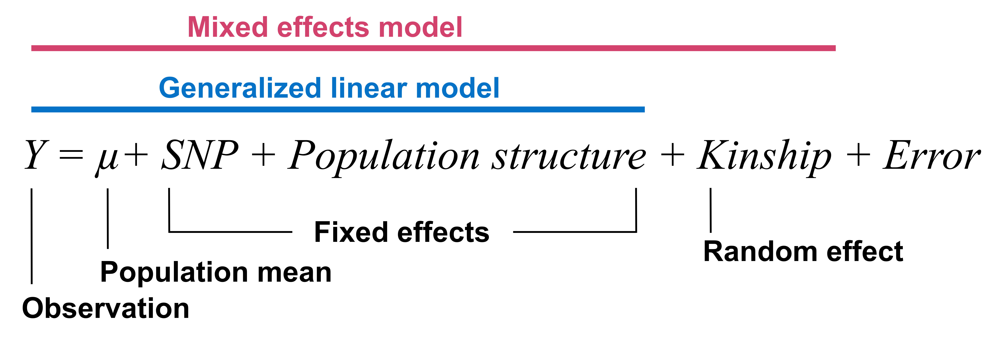
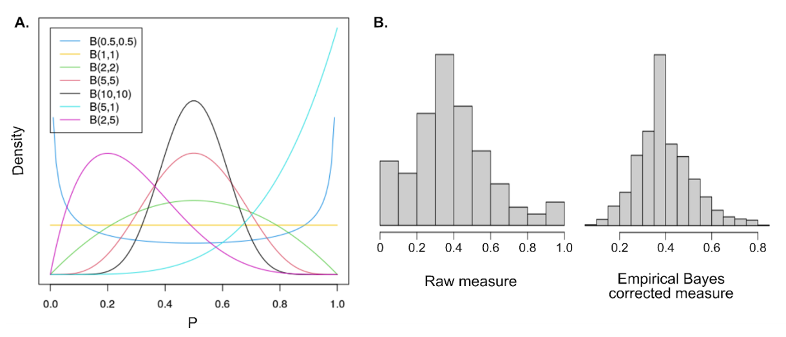
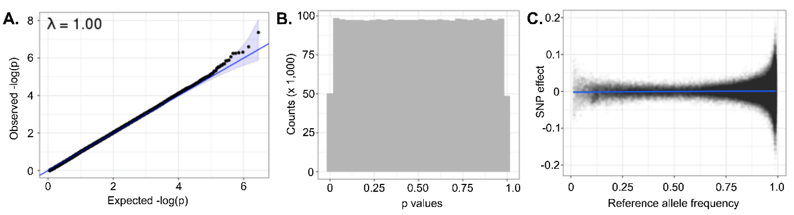

# 4. Whole-genome population and association studies

## 4.5. Genome-wide association studies

Genome-wide association studies (GWAS) are conducted to detect genetic markers that contribute to phenotypic variation between individuals by analyzing phenotypic and genomic information in a unified statistical model (Figure 8). This type of analysis is commonly conducted in livestock species and plants, and an extensive literature and collection of tools, software, and methodologies are available for this purpose (for a review in animal genetics, see Hayes & Goddard (2010)). In this section, we will discuss GWAS in the context of honey bee studies, considering the unique attributes of this species.



###### Figure 8. Generic structure of a GWAS model (adapted from (Yu et al., 2006)).

### 4.5.1. Considerations for phenotypic data

Many different phenotypes or observations are compatible with GWAS. Examples for *Apis* honey bees include, but are not limited to:

-   Traits of agronomic interest, such as honey production, gentleness, or low propensity to swarm

-   Traits linked to phenotypic plasticity and social behavior, such as precocious forager age

-   Traits linked to morphology, such as pigmentation or wing venation

-   Traits linked to survival, such as resistance to parasites (*Varroa spp.*, *Tropilaelaps spp.*, small hive beetle), to viruses, or to specific environmental conditions

-   Traits linked to the colony or individual health, such as viral or bacterial load

-   Traits focusing on genome structure, such as variable recombination rate

Ideally, these characteristics should be measured in a standard way across all the ‘individuals’ or ‘units’ (*e.g.*, colony, caste, or single bee specimen). Measuring traits at the superorganism unit (colony) or at individual levels can be more or less relevant depending on the trait of interest. Traits can be binary, as in a case/control association study (*e.g.*, survival, presence or absence of a virus, performance or not of behavior, *etc*.), categorical (*e.g.*, gentleness scored in classes), or continuous (*e.g.* honey production measured in kilograms). If focusing on a continuous phenotype, it is necessary to analyze individuals representing the whole expected spectrum to distinguish markers impacting the phenotype.

### 4.5.2. Considerations for sample selection

GWAS can be performed on individual samples or composite samples of individuals from the same colony (see [Section 4.2](https://youneedawiki.com/app/page/1Dlftfc-2_gR1pzulaHDakHHMkBNhdY7kYuZb1ldQPm8?p=1rc183pyLOH9HstkT14kQP-SXKx-dffa2) for details on ploidy considerations). Individual samples can represent different colonies or, when more than one individual per colony is sampled, individuals within a colony. These samples may be workers, queens, or drones. For any sample type, an appropriate sample size should be estimated to ensure the analysis has sufficient power to detect associations.

#### 4.5.2.1. Power analysis

Prior to performing a case/control association study, it is useful to estimate the power needed to detect significant markers given a specific experimental design. Such power of detection is linked to the number of individuals in the case versus control group, the number of markers tested and the difference in allele frequency between the two groups. The **R** package **pwr** is strictly dedicated for power analysis functions (Champely et al., 2017, 2018).

### 4.5.3. Materials

#### 4.5.3.1. Computational resources

GWAS requires at least a computer (for small studies), up to a high-performance cluster (for large studies). Specific informatic tools such as **R** or other dedicated software programs (discussed below) for data manipulation, statistical analysis, and visualization are also needed.

#### 4.5.3.2. Genotypic and phenotypic data

Genomic information can be found traditionally in the form of a genotype matrix extracted from VCF files, where different genotypes are specified as 0, 1 and 2. Alternative formats, such as allele frequencies, are also becoming more and more common and highly useful for honey bee genomic studies. A matrix linking phenotypic observations to sample identifiers will also be needed.

### 4.5.4. Methods

#### 4.5.4.1. Preparation of phenotypic data

Classical GWAS methods rely on the assumption that the phenotype of interest follows a normal distribution. Therefore, depending on the trait, corrections such as log, logit, square-root, cube root or, empirical Bayes might be needed to adjust the phenotype distribution to the assumed normality. Unfortunately, as corrections need to be tested independently, no standard protocol can be described here.

We present below an example of an **R** script to perform empirical Bayes correction with beta distribution (Figure 9A). The beta distribution is often used for empirical Bayes correction as the variety of alpha and beta parameters defining the distribution allow for a large range of probability density functions representing most of the observed distribution for ratios and proportions (Figure 9B).

``` r
library(MASS) #Load library
df$pheno = df$num / df$den #estimation of the phenotype as a ratio of num (numerator) on den (denominator)
eb_fit = fitdistr( x = df$pheno[ !is.na(df$pheno) & df$pheno > 0 & df$pheno < 1 ], densfun = "beta", start = list(shape1 = 1, shape2 = 1), method = "L-BFGS-B" ) #fit of beta distributions to the estimated phenotype
aprior = eb_fit$estimate #alpha parameter for the beta distribution estimate for our phenotype
bprior = eb_fit$estimate #beta parameter for the beta distribution estimate for our phenotype
df$pheno_eb = (aprior + df$num) / (aprior + bprior + df$den) #corrected phenotype
```



###### Figure 9. Correcting phenotypic parameters. A) Example distribution of phenotypic values before and after correction using the empirical Bayes method. B) Example of the histogram for a phenotype before and after empirical Bayes transformation. Note the improved distribution after transformation.

#### 4.5.4.2. Preparation of genotypic data

Prior to running a GWAS analysis, we recommend performing a quality control analysis on the genotypes (Wragg et al., 2021). Depending on your data, these quality controls can be based on:\

-   Technical and sequencing characteristics such as genotyping quality (QUAL \> 200 and QD \> 20), depth (20x), or even calling rate (\> 95%).

-   Minor allele frequencies (MAF \> 0.05), or rare variants, are much harder to test accurately than common ones. Depending on the read coverage, rare variants are likely associated with genotyping errors and are often removed without further considerations.

-   Linkage disequilibrium (LD), as assumed for the GWAS models, relies on the independence of the tested markers; therefore, one might want to filter on a LD threshold. Doing so will remove redundancy in the genomic information and might strengthen the signal for some markers of interest.

#### 4.5.4.3. Performing GWAS: Methods and software

Multiple software and packages are available to perform GWAS easily from genomic data (for a partial listing, see in [GWAS tools platform](https://bioinformaticshome.com/tools/gwas/gwas.html#gsc.tab=0)). One standard and popular software is **PLINK** (Purcell et al., 2007). It contains a large panel of functions from data manipulation and filtering to GWAS analysis, making it a preferred tool for analyzing individual diploid data. **PLINK** is compatible with binary phenotype variables (case/control) as could be expected for, *e.g.*, survival. In such a case, standard chi-square analysis on each marker individually can be used. This test gives test statistics and p-values for the difference in allele frequency between the case and control group. See [Section 4.7]{.underline} for more information on using **PLINK**.

However, in *Apis* honey bee colonies, traits are often measured at the group level, making pooled-sample genotype information (*e.g.* allele frequencies or mean genotypes) more relevant. To deal with such data types, we list some tools that have been adapted to be able to analyze pooled data. We recommend using **GEMMA** for analyzing pooled-sample data (Zhou & Stephens, 2012), which allows for mixed linear models as well as Bayesian inference. For small datasets (hundreds of samples), the **LDAK** (Speed et al., 2012) software might be more suitable for performing GWAS. Additionally, **LDAK** also offers potential GWAS computation based on gene annotation rather than genotypes. This allows a straightforward interpretation of the functional effect, since only differences within annotated genes are detected, and reduces the number of statistical tests performed. While new tools are continuously developed to perform GWAS with different settings and data types, the field still lacks dedicated methods that can deal specifically with honey bees and haplodiploidy.

#### 4.5.4.4. Detecting signatures of selection

Although it is not solely restricted to association studies, detecting selection signals (*i.e.* stabilizing selection, directional selection, and diversifying selection) is of significant interest in honey bee genetic analysis to assign selection signals along the genome for specific traits (also known as phenomics). Several software options are available for this purpose, such as **FLK** and **hapFLK** (Bonhomme et al., 2010; Fariello et al., 2013). The use of such methods has helped characterize soft selective sweep in Africanized honey bees in invasive areas (Avalos et al., 2017), through a temporal sampling in native Swiss populations (Parejo et al., 2020) and in association with beekeeping practices (Wragg et al., 2016). Avalos et al., (2017) have curated customs bash and **R** scripts available as supplemental notes, which we recommend as a reproducible workflow using **RsB** for any users who want to start such analysis with honey bee samples (Tang et al., 2007).

### 4.5.5. Sources of variation

Population structure might need to be accounted for by adding covariates in the GWAS model. Such covariates can come from genetic background information (vectors of genetic admixture, commonly called Q vectors), principal component analysis eigenvalues for population structure, environmental effects such as the apiary, effects linked to the beekeeping practice (see [Section 4.6](https://youneedawiki.com/app/page/1JZSXzhUXYZ3R4_535S5pHJTXU3SuZ4rJ?p=1rc183pyLOH9HstkT14kQP-SXKx-dffa2) on population genomics). In addition, a kinship matrix (the relationship between individuals) can be included in the model. This matrix can be estimated based on pedigree records (Brascamp & Bijma, 2014), though it is often challenging for honey bees to have complete genetic records. In *Apis* honey bees, it is especially interesting to consider such a matrix, as relationships across individuals within a colony deviate from standard estimates in diploid livestock species. The software **LDAK** offers additional features. One such feature is the possibility of computing genetic relationship matrices (GRMs) from weighted polymorphisms, which is equivalent to trimming our genomic information based on linkage disequilibrium, as suggested in [Section 4.5.4.2]{.underline}.

In case/control association studies, rigorous experimental design is advantageous, in the sense that matching case and control individuals according to environmental conditions, genetic background, *etc.*, will authorize the researcher to ignore these variables in the analysis.

### 4.5.6. Quality control and data interpretation

To validate that the GWAS performed matches the model hypotheses, we recommend running multiple diagnostic analyses. The most common diagnostic is to draw the Q-Q plot for p-values of the GWAS using **R**. This method allows us to check for an agreement between expected and observed p-values. If a deviation from the expectation is observed, this is a sign of improper fit of the model to the data. This generally indicates that either the phenotype is not properly modeled or that population stratification or structure is not accounted for in the GWAS model. A strong deviation from the diagonal in Q-Q plot (Figure 10A) should lead to further investigation and repetition of the GWAS. Another diagnostic approach can be performed on p-values, as they are expected to follow a uniform distribution. Therefore, checking the histogram of p-values is a relevant diagnostic plot for a good fit of the model (Figure 10B). Finally, checking for unexpected correlations between SNP effects and allele frequencies can inform on misfit of the model or of errors in our data set (Figure 10C).



###### Figure 10. Example diagnostic plots for GWAS study. A) Q-Qplot and associated inflation factor λ, B) histogram of the p-values and C) plot of SNP effects as a function of allele frequencies.

After validation of the study based on the diagnostic plots presented above, we recommend looking into the markers’ p-values and effects. The decision on the significant threshold cut-off for the markers associated with a trait of interest is crucial (often between 1 and 5%). Traditional corrections for multiple testing, such as Bonferroni, can be used but are often too stringent and might cause one to ignore relevant markers. For GWAS, controlling the false discovery rate (FDR) is a standard approach. Recently more methods, like **ash** (Stephens, 2016), are less conservative and better adapted to complex phenotypes. This method expects phenotypes to be highly polygenic with most markers having a negligible effect on the phenotype itself, as can be anticipated for complex honey bee traits. Recent developments have also made it possible to combine multiple analyses on different populations or even phenotypes using the software **Mantra** and **Mr Mega** (Morris, 2011) or **Mash** (Urbut et al., 2019).

Once diagnostic tests are completed, it is time to interpret the effects of the markers, if identified, to describe the genotype/phenotype association. In some studies, a few markers may be detected with large and highly significant effects. In this case, the markers are strong candidates to explain the causal mutation underlying the trait. More often, many markers are detected, having small but significant effects. This is often the case in complex traits that tend to be highly polygenic. If markers are identified, the final step is to inspect the genomic regions of interest and identify candidate causal genes to try to interpret the biological pathways involved.

### 4.5.7. Applications and limitations

The pinnacle goal of GWAS is to identify genetic underpinnings of specific characteristics. The possibilities of traits to focus on are endless, but to date, association studies in honey bees have focused mostly on traits linked to beekeeping practices (Guichard et al., 2021), disease or parasite resistance (Spötter et al., 2016), and health (Wu et al., 2020)*.* In other studies, genome-wide scans have been used to identify selection signals for population-specific features such as royal jelly production (Wragg et al., 2016). Although genetic markers for specific traits were first identified through quantitative trait loci (QTL) mapping (see Evans *et al.* (2013) for a description of this technique), the technique has fallen out of favor as high-throughput sequencing has become more accessible.

Performing GWAS on honey bees can be challenging because the breeding system often makes the colony, which has a diverse genetic makeup, the unit of interest. Moreover, limitations arise whenever divergent and structured populations in honey bees are analyzed together without being properly accounted for in the GWAS model. For example, if bees belonging to different subspecies are analyzed together for a phenotype, the markers identified might be representatives of the different genetic types rather than linked to the phenotype of interest. This can also impact comparative genomics studies (see [Section 4.4](https://youneedawiki.com/app/page/1gNsPlwy9uBCadjKRcnGuEeNalboStTsKx4gl9vGIu68?p=1rc183pyLOH9HstkT14kQP-SXKx-dffa2)) and can lead to misguided interpretations of mechanisms underlying traits of interest.

On top of estimating the effects and significance of targeted markers associated with a trait, it is also possible to evaluate trait heritability with GWAS (Brascamp & Bijma, 2019; Guichard et al., 2021; Jourdan-Pineau et al., 2021). Such heritability measures are population-specific and might vary across studies focusing on different individuals and environments. Furthermore, genomic heritability estimates in honey bees might differ from pedigree heritability estimates, as they are not straightforward to approximate due to haplodiploidy and multiple mating (Jourdan-Pineau et al., 2021). Such heritability information is particularly useful for guiding selective breeding programs.

So far, few research projects report genome wide association study results in honey bees but have already informed on genomic regions associated with aggressive behavior (Avalos et al., 2020; Guichard et al., 2021; Sokolowski, 2020), adaptation to mountainous environments (Everitt et al., 2023), and disease tolerance (Hassanyar et al., 2023). With the increasing availability of genomic data, due to reduction in sequencing costs and improved availability of genotyping chips, we can expect a growth in this field.

However, genome wide association studies in honey bee genomics may still face major challenges. Honey bee genomic data can have high complexity, as it may be derived from workers, drones, or pools of individuals, and there is a lack of dedicated methods to perform GWAS in haplo-diploid organisms. Furthermore, many desirable phenotypes are scored at the colony level, necessitating pooled sampling. Many of these traits (*e.g.* behaviors) are also complex themselves, and can be highly polymorphic, conditional, and polygenic.

Consequently, although efforts are underway (Grozinger & Zayed, 2020), it has been exceedingly challenging for GWAS results to contribute to selection decisions in the form of genomic markers with strong prediction potential for traits of interest. GWAS may be better suited to understanding the biological mechanisms underlying traits of interest for honey bee research.

